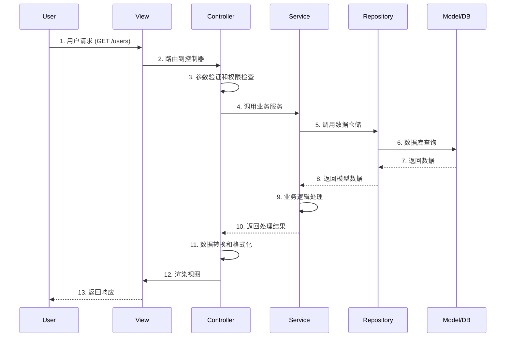

# YYHertz MVC架构详解

<div align="center">

🏗️ **深入理解MVC设计模式** | Model-View-Controller完全指南

</div>

---

## 📋 目录

- [MVC基础概念](#mvc基础概念)
- [Model模型层](#model模型层)
- [View视图层](#view视图层)
- [Controller控制层](#controller控制层)
- [数据流转过程](#数据流转过程)
- [最佳实践](#最佳实践)

---

## 🎯 MVC基础概念

### 什么是MVC？
MVC是一种软件架构模式，将应用程序分为三个核心组件：
- **Model (模型)**: 管理数据和业务逻辑
- **View (视图)**: 处理数据显示和用户界面
- **Controller (控制器)**: 处理用户输入，协调模型和视图

### YYHertz中的MVC实现
```go
// 应用程序入口
func main() {
    app := mvc.HertzApp
    
    // 注册控制器
    app.AutoRouters(&UserController{})
    
    app.Run(":8888")
}
```

---

## 📊 Model模型层

### 1. 数据模型定义

```go
// 用户模型
type User struct {
    ID        uint           `gorm:"primarykey" json:"id"`
    Username  string         `gorm:"size:50;not null;uniqueIndex" json:"username"`
    Email     string         `gorm:"size:100;not null;uniqueIndex" json:"email"`
    Password  string         `gorm:"size:255;not null" json:"-"`  // 不返回到前端
    FirstName string         `gorm:"size:50" json:"first_name"`
    LastName  string         `gorm:"size:50" json:"last_name"`
    Status    UserStatus     `gorm:"default:1" json:"status"`
    Profile   *UserProfile   `gorm:"foreignKey:UserID" json:"profile,omitempty"`
    Roles     []Role         `gorm:"many2many:user_roles" json:"roles,omitempty"`
    CreatedAt time.Time      `json:"created_at"`
    UpdatedAt time.Time      `json:"updated_at"`
    DeletedAt gorm.DeletedAt `gorm:"index" json:"-"`
}

// 用户状态枚举
type UserStatus int

const (
    UserStatusInactive UserStatus = 0
    UserStatusActive   UserStatus = 1
    UserStatusSuspended UserStatus = 2
)

// 表名指定
func (User) TableName() string {
    return "users"
}

// 模型方法 - 业务逻辑
func (u *User) IsActive() bool {
    return u.Status == UserStatusActive
}

func (u *User) GetFullName() string {
    return strings.TrimSpace(u.FirstName + " " + u.LastName)
}

func (u *User) HasRole(roleName string) bool {
    for _, role := range u.Roles {
        if role.Name == roleName {
            return true
        }
    }
    return false
}
```

### 2. 关联模型

```go
// 用户资料模型
type UserProfile struct {
    ID        uint      `gorm:"primarykey" json:"id"`
    UserID    uint      `gorm:"not null;index" json:"user_id"`
    Avatar    string    `gorm:"size:255" json:"avatar"`
    Bio       string    `gorm:"type:text" json:"bio"`
    Website   string    `gorm:"size:255" json:"website"`
    Location  string    `gorm:"size:100" json:"location"`
    Birthday  *time.Time `json:"birthday"`
    CreatedAt time.Time `json:"created_at"`
    UpdatedAt time.Time `json:"updated_at"`
}

// 角色模型
type Role struct {
    ID          uint         `gorm:"primarykey" json:"id"`
    Name        string       `gorm:"size:50;not null;uniqueIndex" json:"name"`
    DisplayName string       `gorm:"size:100" json:"display_name"`
    Description string       `gorm:"type:text" json:"description"`
    Permissions []Permission `gorm:"many2many:role_permissions" json:"permissions,omitempty"`
    CreatedAt   time.Time    `json:"created_at"`
    UpdatedAt   time.Time    `json:"updated_at"`
}

// 权限模型
type Permission struct {
    ID          uint      `gorm:"primarykey" json:"id"`
    Name        string    `gorm:"size:50;not null;uniqueIndex" json:"name"`
    DisplayName string    `gorm:"size:100" json:"display_name"`
    Description string    `gorm:"type:text" json:"description"`
    Resource    string    `gorm:"size:50;not null" json:"resource"`
    Action      string    `gorm:"size:50;not null" json:"action"`
    CreatedAt   time.Time `json:"created_at"`
    UpdatedAt   time.Time `json:"updated_at"`
}
```

### 3. 数据传输对象 (DTO)

```go
// 创建用户请求
type CreateUserRequest struct {
    Username  string `json:"username" validate:"required,min=3,max=20,alphanum"`
    Email     string `json:"email" validate:"required,email"`
    Password  string `json:"password" validate:"required,min=8"`
    FirstName string `json:"first_name" validate:"max=50"`
    LastName  string `json:"last_name" validate:"max=50"`
}

// 更新用户请求
type UpdateUserRequest struct {
    FirstName *string     `json:"first_name,omitempty" validate:"omitempty,max=50"`
    LastName  *string     `json:"last_name,omitempty" validate:"omitempty,max=50"`
    Status    *UserStatus `json:"status,omitempty" validate:"omitempty,min=0,max=2"`
}

// 用户响应
type UserResponse struct {
    ID        uint       `json:"id"`
    Username  string     `json:"username"`
    Email     string     `json:"email"`
    FirstName string     `json:"first_name"`
    LastName  string     `json:"last_name"`
    FullName  string     `json:"full_name"`
    Status    UserStatus `json:"status"`
    CreatedAt time.Time  `json:"created_at"`
    UpdatedAt time.Time  `json:"updated_at"`
}

// 模型到响应的转换
func (u *User) ToResponse() *UserResponse {
    return &UserResponse{
        ID:        u.ID,
        Username:  u.Username,
        Email:     u.Email,
        FirstName: u.FirstName,
        LastName:  u.LastName,
        FullName:  u.GetFullName(),
        Status:    u.Status,
        CreatedAt: u.CreatedAt,
        UpdatedAt: u.UpdatedAt,
    }
}
```

### 4. 仓储模式 (Repository Pattern)

```go
// 用户仓储接口
type UserRepositoryInterface interface {
    Create(user *User) error
    GetByID(id uint) (*User, error)
    GetByUsername(username string) (*User, error)
    GetByEmail(email string) (*User, error)
    Update(user *User) error
    Delete(id uint) error
    GetList(filters *UserFilters, page, size int) ([]User, int64, error)
}

// 用户仓储实现
type UserRepository struct {
    db *gorm.DB
}

func NewUserRepository(db *gorm.DB) UserRepositoryInterface {
    return &UserRepository{db: db}
}

func (r *UserRepository) Create(user *User) error {
    return r.db.Create(user).Error
}

func (r *UserRepository) GetByID(id uint) (*User, error) {
    var user User
    err := r.db.Preload("Profile").Preload("Roles").First(&user, id).Error
    if err != nil {
        if errors.Is(err, gorm.ErrRecordNotFound) {
            return nil, ErrUserNotFound
        }
        return nil, err
    }
    return &user, nil
}

func (r *UserRepository) GetList(filters *UserFilters, page, size int) ([]User, int64, error) {
    var users []User
    var total int64
    
    query := r.db.Model(&User{})
    
    // 应用过滤器
    if filters.Status != nil {
        query = query.Where("status = ?", *filters.Status)
    }
    if filters.Keyword != "" {
        query = query.Where("username LIKE ? OR email LIKE ?", 
            "%"+filters.Keyword+"%", "%"+filters.Keyword+"%")
    }
    
    // 获取总数
    if err := query.Count(&total).Error; err != nil {
        return nil, 0, err
    }
    
    // 分页查询
    offset := (page - 1) * size
    err := query.Offset(offset).Limit(size).
        Order("created_at DESC").
        Preload("Profile").
        Find(&users).Error
    
    return users, total, err
}

// 查询过滤器
type UserFilters struct {
    Status  *UserStatus `json:"status"`
    Keyword string      `json:"keyword"`
}
```

---

## 🎨 View视图层

### 1. HTML模板视图

```html
<!-- views/layouts/base.html -->
<!DOCTYPE html>
<html lang="zh-CN">
<head>
    <meta charset="UTF-8">
    <meta name="viewport" content="width=device-width, initial-scale=1.0">
    <title>{{.title}} - YYHertz App</title>
    <link href="/static/css/bootstrap.min.css" rel="stylesheet">
    <link href="/static/css/app.css" rel="stylesheet">
</head>
<body>
    <!-- 导航栏 -->
    {{templatefunc "partials/navbar.html" .}}
    
    <!-- 主要内容 -->
    <main class="container mt-4">
        {{if .flash_message}}
        <div class="alert alert-{{.flash_type}} alert-dismissible fade show">
            {{.flash_message}}
            <button type="button" class="btn-close" data-bs-dismiss="alert"></button>
        </div>
        {{end}}
        
        {{template "content" .}}
    </main>
    
    <!-- 页脚 -->
    {{templatefunc "partials/footer.html" .}}
    
    <script src="/static/js/bootstrap.bundle.min.js"></script>
    <script src="/static/js/app.js"></script>
</body>
</html>

<!-- views/users/index.html -->
{{define "content"}}
<div class="d-flex justify-content-between align-items-center mb-4">
    <h1>用户管理</h1>
    <a href="/users/create" class="btn btn-primary">新增用户</a>
</div>

<!-- 搜索表单 -->
<div class="card mb-4">
    <div class="card-body">
        <form method="GET" class="row g-3">
            <div class="col-md-4">
                <input type="text" name="keyword" class="form-control" 
                       placeholder="搜索用户名或邮箱" value="{{.filters.keyword}}">
            </div>
            <div class="col-md-3">
                <select name="status" class="form-select">
                    <option value="">全部状态</option>
                    <option value="1" {{if equal .filters.status 1}}selected{{end}}>激活</option>
                    <option value="0" {{if equal .filters.status 0}}selected{{end}}>未激活</option>
                    <option value="2" {{if equal .filters.status 2}}selected{{end}}>已暂停</option>
                </select>
            </div>
            <div class="col-md-2">
                <button type="submit" class="btn btn-outline-secondary w-100">搜索</button>
            </div>
        </form>
    </div>
</div>

<!-- 用户列表 -->
<div class="card">
    <div class="card-body">
        <div class="table-responsive">
            <table class="table table-striped">
                <thead>
                    <tr>
                        <th>ID</th>
                        <th>用户名</th>
                        <th>邮箱</th>
                        <th>姓名</th>
                        <th>状态</th>
                        <th>注册时间</th>
                        <th>操作</th>
                    </tr>
                </thead>
                <tbody>
                    {{range .users}}
                    <tr>
                        <td>{{.ID}}</td>
                        <td>{{.Username}}</td>
                        <td>{{.Email}}</td>
                        <td>{{.GetFullName}}</td>
                        <td>
                            {{if equal .Status 1}}
                                <span class="badge bg-success">激活</span>
                            {{else if equal .Status 0}}
                                <span class="badge bg-secondary">未激活</span>
                            {{else}}
                                <span class="badge bg-warning">已暂停</span>
                            {{end}}
                        </td>
                        <td>{{dateformat .CreatedAt "2006-01-02 15:04"}}</td>
                        <td>
                            <div class="btn-group btn-group-sm">
                                <a href="/users/{{.ID}}" class="btn btn-outline-primary">查看</a>
                                <a href="/users/{{.ID}}/edit" class="btn btn-outline-secondary">编辑</a>
                                <button class="btn btn-outline-danger" onclick="deleteUser({{.ID}})">删除</button>
                            </div>
                        </td>
                    </tr>
                    {{else}}
                    <tr>
                        <td colspan="7" class="text-center text-muted">暂无用户数据</td>
                    </tr>
                    {{end}}
                </tbody>
            </table>
        </div>
        
        <!-- 分页 -->
        {{if gt .totalPages 1}}
        <nav class="mt-3">
            <ul class="pagination justify-content-center">
                {{if gt .currentPage 1}}
                <li class="page-item">
                    <a class="page-link" href="?page={{subtract .currentPage 1}}&{{.queryString}}">上一页</a>
                </li>
                {{end}}
                
                {{range makerange 1 .totalPages}}
                <li class="page-item {{if equal . $.currentPage}}active{{end}}">
                    <a class="page-link" href="?page={{.}}&{{$.queryString}}">{{.}}</a>
                </li>
                {{end}}
                
                {{if lt .currentPage .totalPages}}
                <li class="page-item">
                    <a class="page-link" href="?page={{add .currentPage 1}}&{{.queryString}}">下一页</a>
                </li>
                {{end}}
            </ul>
        </nav>
        {{end}}
    </div>
</div>
{{end}}
```

### 2. JSON API视图

```go
// API响应结构
type APIResponse struct {
    Success   bool        `json:"success"`
    Code      int         `json:"code"`
    Message   string      `json:"message"`
    Data      interface{} `json:"data,omitempty"`
    Meta      *Meta       `json:"meta,omitempty"`
    Timestamp int64       `json:"timestamp"`
}

type Meta struct {
    CurrentPage int   `json:"current_page"`
    PerPage     int   `json:"per_page"`
    Total       int64 `json:"total"`
    TotalPages  int   `json:"total_pages"`
}

// 分页响应
type PaginatedResponse struct {
    Items []interface{} `json:"items"`
    Meta  *Meta         `json:"meta"`
}
```

---

## 🎛️ Controller控制层

### 1. 基础控制器

```go
// 用户控制器
type UserController struct {
    mvc.BaseController
    userService *UserService
}

// 构造函数
func NewUserController(userService *UserService) *UserController {
    return &UserController{
        userService: userService,
    }
}

// 控制器生命周期方法
func (c *UserController) Prepare() {
    // 前置处理：权限检查、参数预处理等
    c.Data["title"] = "用户管理"
    
    // 检查用户是否已登录
    if !c.IsLoggedIn() {
        c.Redirect("/login", 302)
        return
    }
    
    // 检查权限
    if !c.HasPermission("user.manage") {
        c.ErrorHTML(403, "权限不足")
        return
    }
}

func (c *UserController) Finish() {
    // 后置处理：清理资源、记录日志等
    c.LogAccess()
}
```

### 2. CRUD操作实现

```go
// GET /users - 用户列表
func (c *UserController) GetIndex() {
    // 获取查询参数
    page := c.GetInt("page", 1)
    size := c.GetInt("size", 20)
    keyword := c.GetString("keyword")
    status := c.GetInt("status", -1)
    
    // 构建过滤器
    filters := &UserFilters{
        Keyword: keyword,
    }
    if status >= 0 {
        userStatus := UserStatus(status)
        filters.Status = &userStatus
    }
    
    // 调用服务层
    users, total, err := c.userService.GetUserList(filters, page, size)
    if err != nil {
        c.ErrorHTML(500, "获取用户列表失败: "+err.Error())
        return
    }
    
    // 准备模板数据
    totalPages := int(math.Ceil(float64(total) / float64(size)))
    
    c.Data["users"] = users
    c.Data["currentPage"] = page
    c.Data["totalPages"] = totalPages
    c.Data["total"] = total
    c.Data["filters"] = filters
    c.Data["queryString"] = c.BuildQueryString(map[string]interface{}{
        "keyword": keyword,
        "status":  status,
        "size":    size,
    })
    
    // 渲染模板
    c.TplName = "users/index.html"
}

// GET /users/:id - 用户详情
func (c *UserController) GetDetail() {
    id, err := c.GetInt("id")
    if err != nil {
        c.ErrorHTML(400, "无效的用户ID")
        return
    }
    
    user, err := c.userService.GetUserByID(uint(id))
    if err != nil {
        if errors.Is(err, ErrUserNotFound) {
            c.ErrorHTML(404, "用户不存在")
        } else {
            c.ErrorHTML(500, "获取用户信息失败")
        }
        return
    }
    
    c.Data["user"] = user
    c.TplName = "users/detail.html"
}

// GET /users/create - 创建用户表单
func (c *UserController) GetCreate() {
    c.Data["title"] = "新增用户"
    c.TplName = "users/create.html"
}

// POST /users/create - 处理用户创建
func (c *UserController) PostCreate() {
    var req CreateUserRequest
    
    // 绑定请求数据
    if err := c.ParseForm(&req); err != nil {
        c.Flash("error", "请求数据格式错误")
        c.Redirect("/users/create", 302)
        return
    }
    
    // 验证数据
    if err := c.ValidateStruct(&req); err != nil {
        c.Data["errors"] = err
        c.Data["form"] = req
        c.TplName = "users/create.html"
        return
    }
    
    // 调用服务层创建用户
    user, err := c.userService.CreateUser(&req)
    if err != nil {
        if errors.Is(err, ErrUserExists) {
            c.Flash("error", "用户名或邮箱已存在")
        } else {
            c.Flash("error", "创建用户失败: "+err.Error())
        }
        c.Redirect("/users/create", 302)
        return
    }
    
    c.Flash("success", "用户创建成功")
    c.Redirect("/users/"+strconv.Itoa(int(user.ID)), 302)
}

// PUT /users/:id - 更新用户
func (c *UserController) PutUpdate() {
    id, err := c.GetInt("id")
    if err != nil {
        c.ErrorJSON(400, "无效的用户ID")
        return
    }
    
    var req UpdateUserRequest
    if err := c.BindJSON(&req); err != nil {
        c.ErrorJSON(400, "请求数据格式错误")
        return
    }
    
    if err := c.ValidateStruct(&req); err != nil {
        c.ValidationErrorJSON(err)
        return
    }
    
    user, err := c.userService.UpdateUser(uint(id), &req)
    if err != nil {
        if errors.Is(err, ErrUserNotFound) {
            c.ErrorJSON(404, "用户不存在")
        } else {
            c.ErrorJSON(500, "更新用户失败")
        }
        return
    }
    
    c.SuccessJSON(user.ToResponse())
}

// DELETE /users/:id - 删除用户
func (c *UserController) DeleteRemove() {
    id, err := c.GetInt("id")
    if err != nil {
        c.ErrorJSON(400, "无效的用户ID")
        return
    }
    
    err = c.userService.DeleteUser(uint(id))
    if err != nil {
        if errors.Is(err, ErrUserNotFound) {
            c.ErrorJSON(404, "用户不存在")
        } else {
            c.ErrorJSON(500, "删除用户失败")
        }
        return
    }
    
    c.SuccessJSON(nil)
}
```

### 3. API控制器

```go
// API版本的用户控制器
type UserAPIController struct {
    mvc.BaseController
    userService *UserService
}

// GET /api/users - 用户列表API
func (c *UserAPIController) GetList() {
    page := c.GetInt("page", 1)
    size := c.GetInt("size", 20)
    
    if size > 100 {
        size = 100 // 限制每页最大数量
    }
    
    users, total, err := c.userService.GetUserList(nil, page, size)
    if err != nil {
        c.ErrorJSON(500, "获取用户列表失败")
        return
    }
    
    // 转换为响应格式
    var userResponses []UserResponse
    for _, user := range users {
        userResponses = append(userResponses, *user.ToResponse())
    }
    
    // 构建分页信息
    totalPages := int(math.Ceil(float64(total) / float64(size)))
    meta := &Meta{
        CurrentPage: page,
        PerPage:     size,
        Total:       total,
        TotalPages:  totalPages,
    }
    
    response := &PaginatedResponse{
        Items: make([]interface{}, len(userResponses)),
        Meta:  meta,
    }
    
    for i, user := range userResponses {
        response.Items[i] = user
    }
    
    c.SuccessJSON(response)
}
```

---

## 🔄 数据流转过程

### 典型的MVC数据流转



### 请求处理流程

```go
func (c *UserController) ProcessRequest() {
    // 1. 前置处理
    c.Prepare()
    
    // 2. 参数获取和验证
    params := c.GetRequestParams()
    if err := c.ValidateParams(params); err != nil {
        c.HandleValidationError(err)
        return
    }
    
    // 3. 业务逻辑处理
    result, err := c.userService.ProcessBusiness(params)
    if err != nil {
        c.HandleBusinessError(err)
        return
    }
    
    // 4. 响应数据准备
    response := c.PrepareResponse(result)
    
    // 5. 视图渲染
    c.RenderView(response)
    
    // 6. 后置处理
    c.Finish()
}
```

---

## 💡 最佳实践

### 1. 控制器职责分离

```go
// ❌ 错误做法：控制器包含太多业务逻辑
func (c *UserController) GetUsers() {
    // 数据库查询逻辑不应该在控制器中
    var users []User
    db.Where("status = ?", 1).Find(&users)
    
    // 复杂的数据处理逻辑不应该在控制器中
    for i, user := range users {
        users[i].Password = ""  // 清除密码字段
        // 复杂的计算逻辑...
    }
    
    c.JSON(users)
}

// ✅ 正确做法：控制器只负责协调
func (c *UserController) GetUsers() {
    // 参数获取
    page := c.GetInt("page", 1)
    size := c.GetInt("size", 20)
    
    // 调用服务层
    users, err := c.userService.GetActiveUsers(page, size)
    if err != nil {
        c.ErrorJSON(500, "获取用户列表失败")
        return
    }
    
    // 返回响应
    c.SuccessJSON(users)
}
```

### 2. 模型设计原则

```go
// ✅ 好的模型设计
type User struct {
    // 使用合适的数据类型
    ID        uint      `gorm:"primarykey"`
    Username  string    `gorm:"size:50;not null;uniqueIndex"`
    Email     string    `gorm:"size:100;not null;uniqueIndex"`
    
    // 敏感字段不输出到JSON
    Password  string    `gorm:"size:255;not null" json:"-"`
    
    // 使用枚举提高类型安全
    Status    UserStatus `gorm:"default:1"`
    
    // 时间字段使用指针类型，支持NULL
    Birthday  *time.Time
    
    // 软删除支持
    DeletedAt gorm.DeletedAt `gorm:"index"`
}

// 业务方法
func (u *User) CanLogin() bool {
    return u.Status == UserStatusActive && u.DeletedAt.Time.IsZero()
}

// 数据转换方法
func (u *User) ToPublicJSON() map[string]interface{} {
    return map[string]interface{}{
        "id":         u.ID,
        "username":   u.Username,
        "email":      u.Email,
        "created_at": u.CreatedAt,
    }
}
```

### 3. 视图层最佳实践

```html
<!-- ✅ 使用模板继承 -->
{{define "content"}}
<div class="user-list">
    <!-- 使用组件化模板 -->
    {{templatefunc "components/search-form.html" .searchForm}}
    
    <!-- 使用循环和条件 -->
    {{range .users}}
    <div class="user-card">
        <h3>{{.Username}}</h3>
        <p>{{.Email}}</p>
        
        <!-- 使用安全的模板函数 -->
        <span class="status {{if equal .Status 1}}active{{else}}inactive{{end}}">
            {{if equal .Status 1}}激活{{else}}未激活{{end}}
        </span>
        
        <!-- 使用日期格式化函数 -->
        <small>注册时间: {{dateformat .CreatedAt "2006-01-02"}}</small>
    </div>
    {{else}}
    <div class="empty-state">
        <p>暂无用户数据</p>
    </div>
    {{end}}
</div>
{{end}}

<!-- 组件化模板 components/search-form.html -->
<form class="search-form" method="GET">
    <div class="form-group">
        <input type="text" name="keyword" value="{{.keyword}}" placeholder="搜索用户">
        <select name="status">
            <option value="">全部状态</option>
            <option value="1" {{if equal .status "1"}}selected{{end}}>激活</option>
            <option value="0" {{if equal .status "0"}}selected{{end}}>未激活</option>
        </select>
        <button type="submit">搜索</button>
    </div>
</form>
```

### 4. 错误处理策略

```go
// 统一错误处理
func (c *BaseController) HandleError(err error) {
    switch {
    case errors.Is(err, ErrUserNotFound):
        c.ErrorJSON(404, "用户不存在")
    case errors.Is(err, ErrValidationFailed):
        c.ValidationErrorJSON(err)
    case errors.Is(err, ErrPermissionDenied):
        c.ErrorJSON(403, "权限不足")
    default:
        // 记录详细错误日志
        c.Logger.Error("Unexpected error", "error", err.Error())
        c.ErrorJSON(500, "内部服务器错误")
    }
}

// 业务错误定义
var (
    ErrUserNotFound      = errors.New("user not found")
    ErrValidationFailed  = errors.New("validation failed")
    ErrPermissionDenied  = errors.New("permission denied")
)
```

---

<div align="center">

**🏗️ 理解MVC架构是掌握YYHertz的基础**

**合理的职责分离让代码更清晰、更易维护！💡**

</div>