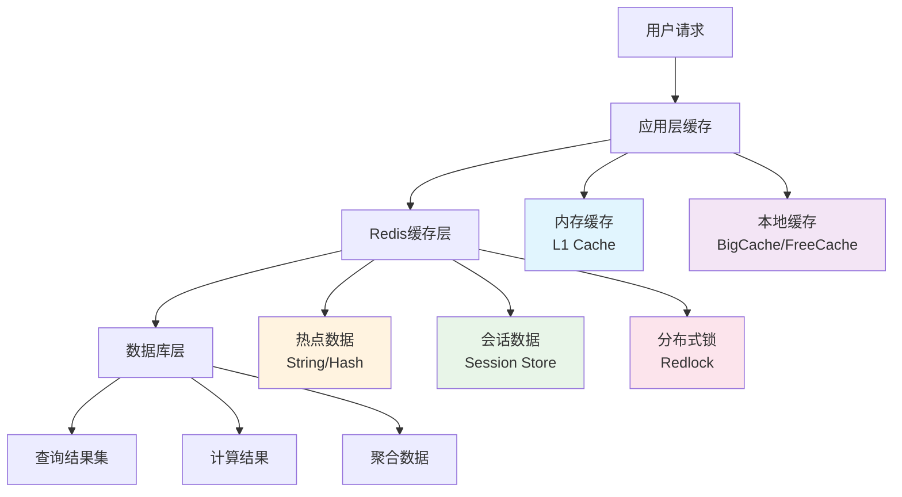

# 缓存策略

YYHertz框架的多层缓存设计与Redis集成方案，涵盖缓存模式、一致性保证、性能优化等核心技术。

## 🎯 缓存架构总览

### 多层缓存体系



### 缓存层次设计

| 缓存层级 | 存储介质 | 容量 | 延迟 | 适用场景 |
|----------|----------|------|------|----------|
| **L1 内存缓存** | 应用内存 | 10MB-100MB | <1ms | 热点小数据 |
| **L2 本地缓存** | 应用堆外内存 | 100MB-1GB | 1-5ms | 频繁访问数据 |
| **L3 Redis缓存** | Redis内存 | 1GB-100GB | 5-50ms | 共享缓存数据 |
| **L4 数据库缓存** | MySQL Buffer Pool | 1GB-64GB | 50-200ms | 数据库查询缓存 |

## 🔧 YYHertz缓存集成

### 1. 缓存配置

#### `conf/cache.yaml`

```yaml
# Redis缓存配置
redis:
  # 主Redis实例
  master:
    host: "localhost"
    port: 6379
    password: "${REDIS_PASSWORD}"
    db: 0
    
    # 连接池配置
    pool_size: 10
    min_idle_conns: 5
    max_retries: 3
    dial_timeout: "5s"
    read_timeout: "3s"
    write_timeout: "3s"
    pool_timeout: "4s"
    idle_timeout: "5m"
    idle_check_frequency: "1m"
  
  # Redis集群模式
  cluster:
    enabled: false
    nodes:
      - "redis-1:6379"
      - "redis-2:6379"  
      - "redis-3:6379"
    
  # 哨兵模式
  sentinel:
    enabled: false
    master_name: "mymaster"
    sentinels:
      - "sentinel-1:26379"
      - "sentinel-2:26379"

# 本地缓存配置
local_cache:
  # BigCache配置
  bigcache:
    enabled: true
    shards: 1024
    life_window: "10m"
    clean_window: "5m"
    max_entries_in_window: 1000
    max_entry_size: 500
    hard_max_cache_size: 256  # MB
  
  # 内存缓存配置
  memory:
    enabled: true
    max_size: "64MB"
    default_expiration: "5m"
    cleanup_interval: "10m"

# 缓存策略配置
strategy:
  # 默认过期时间
  default_ttl: "1h"
  
  # 缓存预热
  warm_up:
    enabled: true
    parallel_workers: 5
    
  # 缓存雪崩防护
  avalanche_protection:
    enabled: true
    jitter_factor: 0.1  # TTL随机因子
    
  # 缓存击穿防护
  penetration_protection:
    enabled: true
    bloom_filter: true
    null_cache_ttl: "5m"
```

### 2. 缓存管理器实现

```go
package cache

import (
    "context"
    "encoding/json"
    "fmt"
    "time"
    "math/rand"
    
    "github.com/go-redis/redis/v8"
    "github.com/allegro/bigcache/v3"
    "github.com/patrickmn/go-cache"
    "github.com/sirupsen/logrus"
)

// 多层缓存管理器
type CacheManager struct {
    redis    *redis.Client
    bigCache *bigcache.BigCache
    memCache *cache.Cache
    config   *CacheConfig
}

// 缓存配置
type CacheConfig struct {
    DefaultTTL    time.Duration `yaml:"default_ttl"`
    JitterFactor  float64      `yaml:"jitter_factor"`
    NullCacheTTL  time.Duration `yaml:"null_cache_ttl"`
}

// 创建缓存管理器
func NewCacheManager(redisClient *redis.Client, config *CacheConfig) (*CacheManager, error) {
    // BigCache配置
    bigCacheConfig := bigcache.Config{
        Shards:             1024,
        LifeWindow:         10 * time.Minute,
        CleanWindow:        5 * time.Minute,
        MaxEntriesInWindow: 1000,
        MaxEntrySize:       500,
        HardMaxCacheSize:   256, // MB
    }
    
    bigCache, err := bigcache.NewBigCache(bigCacheConfig)
    if err != nil {
        return nil, err
    }
    
    // 内存缓存
    memCache := cache.New(5*time.Minute, 10*time.Minute)
    
    return &CacheManager{
        redis:    redisClient,
        bigCache: bigCache,
        memCache: memCache,
        config:   config,
    }, nil
}

// 通用缓存接口
type CacheKey struct {
    Key    string
    TTL    time.Duration
    Layer  CacheLayer
}

type CacheLayer int

const (
    L1Cache CacheLayer = iota // 内存缓存
    L2Cache                   // BigCache
    L3Cache                   // Redis
    AllLayers                 // 所有层级
)

// 获取缓存
func (cm *CacheManager) Get(ctx context.Context, key string, dest interface{}) error {
    // L1 内存缓存
    if data, found := cm.memCache.Get(key); found {
        return cm.unmarshal(data.([]byte), dest)
    }
    
    // L2 BigCache
    if data, err := cm.bigCache.Get(key); err == nil {
        // 同步到L1
        cm.memCache.Set(key, data, cm.config.DefaultTTL)
        return cm.unmarshal(data, dest)
    }
    
    // L3 Redis缓存
    data, err := cm.redis.Get(ctx, key).Bytes()
    if err != nil && err != redis.Nil {
        return err
    }
    
    if err != redis.Nil {
        // 同步到L1和L2
        cm.memCache.Set(key, data, cm.config.DefaultTTL)
        cm.bigCache.Set(key, data)
        return cm.unmarshal(data, dest)
    }
    
    return ErrCacheNotFound
}

// 设置缓存
func (cm *CacheManager) Set(ctx context.Context, key string, value interface{}, ttl time.Duration) error {
    data, err := cm.marshal(value)
    if err != nil {
        return err
    }
    
    // 添加TTL抖动，防止缓存雪崩
    jitteredTTL := cm.addJitter(ttl)
    
    // 设置到所有层级
    cm.memCache.Set(key, data, jitteredTTL)
    cm.bigCache.Set(key, data)
    
    return cm.redis.Set(ctx, key, data, jitteredTTL).Err()
}

// TTL抖动
func (cm *CacheManager) addJitter(ttl time.Duration) time.Duration {
    if cm.config.JitterFactor <= 0 {
        return ttl
    }
    
    jitter := time.Duration(rand.Float64() * float64(ttl) * cm.config.JitterFactor)
    return ttl + jitter
}

// 删除缓存
func (cm *CacheManager) Delete(ctx context.Context, key string) error {
    cm.memCache.Delete(key)
    cm.bigCache.Delete(key)
    return cm.redis.Del(ctx, key).Err()
}

// 序列化
func (cm *CacheManager) marshal(v interface{}) ([]byte, error) {
    return json.Marshal(v)
}

// 反序列化
func (cm *CacheManager) unmarshal(data []byte, v interface{}) error {
    return json.Unmarshal(data, v)
}
```

## 🎨 缓存模式实现

### 1. Cache-Aside模式

```go
// Cache-Aside缓存模式
func (c *UserController) GetUserByID(ctx context.Context, userID int64) (*User, error) {
    cacheKey := fmt.Sprintf("user:%d", userID)
    
    // 1. 先查缓存
    var user User
    err := c.cacheManager.Get(ctx, cacheKey, &user)
    if err == nil {
        // 缓存命中
        return &user, nil
    }
    
    if err != ErrCacheNotFound {
        // 缓存查询出错，记录日志但继续查数据库
        logrus.WithError(err).Warn("缓存查询失败")
    }
    
    // 2. 缓存未命中，查询数据库
    err = c.db.First(&user, userID).Error
    if err != nil {
        if errors.Is(err, gorm.ErrRecordNotFound) {
            // 缓存空值，防止缓存击穿
            c.cacheManager.Set(ctx, cacheKey, nil, c.config.NullCacheTTL)
        }
        return nil, err
    }
    
    // 3. 将结果写入缓存
    err = c.cacheManager.Set(ctx, cacheKey, &user, time.Hour)
    if err != nil {
        logrus.WithError(err).Warn("缓存写入失败")
    }
    
    return &user, nil
}

// 更新时删除缓存
func (c *UserController) UpdateUser(ctx context.Context, userID int64, updates map[string]interface{}) error {
    err := c.db.Model(&User{}).Where("id = ?", userID).Updates(updates).Error
    if err != nil {
        return err
    }
    
    // 删除相关缓存
    cacheKey := fmt.Sprintf("user:%d", userID)
    c.cacheManager.Delete(ctx, cacheKey)
    
    return nil
}
```

### 2. Write-Through模式

```go
// Write-Through缓存模式
func (c *UserController) SaveUserWithCache(ctx context.Context, user *User) error {
    // 1. 写入数据库
    err := c.db.Save(user).Error
    if err != nil {
        return err
    }
    
    // 2. 同步写入缓存
    cacheKey := fmt.Sprintf("user:%d", user.ID)
    err = c.cacheManager.Set(ctx, cacheKey, user, time.Hour)
    if err != nil {
        // 缓存写入失败，记录日志但不影响主流程
        logrus.WithError(err).Error("Write-Through缓存写入失败")
    }
    
    return nil
}
```

### 3. Write-Behind模式

```go
// Write-Behind异步写入队列
type WriteBackQueue struct {
    queue   chan *WriteBackItem
    manager *CacheManager
    db      *gorm.DB
}

type WriteBackItem struct {
    Key   string
    Value interface{}
    Op    WriteOp
}

type WriteOp int

const (
    OpInsert WriteOp = iota
    OpUpdate
    OpDelete
)

func NewWriteBackQueue(manager *CacheManager, db *gorm.DB, workers int) *WriteBackQueue {
    wbq := &WriteBackQueue{
        queue:   make(chan *WriteBackItem, 1000),
        manager: manager,
        db:      db,
    }
    
    // 启动后台写入协程
    for i := 0; i < workers; i++ {
        go wbq.worker()
    }
    
    return wbq
}

func (wbq *WriteBackQueue) worker() {
    for item := range wbq.queue {
        switch item.Op {
        case OpInsert:
            wbq.db.Create(item.Value)
        case OpUpdate:
            wbq.db.Save(item.Value)
        case OpDelete:
            wbq.db.Delete(item.Value)
        }
    }
}

// Write-Behind更新
func (c *UserController) UpdateUserAsync(ctx context.Context, user *User) error {
    // 1. 立即更新缓存
    cacheKey := fmt.Sprintf("user:%d", user.ID)
    err := c.cacheManager.Set(ctx, cacheKey, user, time.Hour)
    if err != nil {
        return err
    }
    
    // 2. 异步写入数据库
    c.writeBackQueue.queue <- &WriteBackItem{
        Key:   cacheKey,
        Value: user,
        Op:    OpUpdate,
    }
    
    return nil
}
```

## 🔒 分布式缓存一致性

### 1. 分布式锁实现

```go
package lock

import (
    "context"
    "time"
    "github.com/go-redis/redis/v8"
)

// 分布式锁
type DistributedLock struct {
    redis  *redis.Client
    key    string
    value  string
    expiry time.Duration
}

// 获取锁
func (dl *DistributedLock) Lock(ctx context.Context) error {
    // 使用SET命令的NX和EX选项实现原子操作
    result, err := dl.redis.SetNX(ctx, dl.key, dl.value, dl.expiry).Result()
    if err != nil {
        return err
    }
    
    if !result {
        return ErrLockFailed
    }
    
    return nil
}

// 释放锁
func (dl *DistributedLock) Unlock(ctx context.Context) error {
    // Lua脚本确保原子性释放
    luaScript := `
        if redis.call("get", KEYS[1]) == ARGV[1] then
            return redis.call("del", KEYS[1])
        else
            return 0
        end
    `
    
    result, err := dl.redis.Eval(ctx, luaScript, []string{dl.key}, dl.value).Result()
    if err != nil {
        return err
    }
    
    if result.(int64) == 0 {
        return ErrLockNotOwned
    }
    
    return nil
}

// 使用分布式锁的缓存更新
func (c *UserController) UpdateUserWithLock(ctx context.Context, userID int64, updates map[string]interface{}) error {
    lockKey := fmt.Sprintf("lock:user:%d", userID)
    lock := &DistributedLock{
        redis:  c.redis,
        key:    lockKey,
        value:  generateLockValue(),
        expiry: 30 * time.Second,
    }
    
    // 获取锁
    err := lock.Lock(ctx)
    if err != nil {
        return err
    }
    defer lock.Unlock(ctx)
    
    // 在锁保护下更新数据
    err = c.db.Model(&User{}).Where("id = ?", userID).Updates(updates).Error
    if err != nil {
        return err
    }
    
    // 删除缓存
    cacheKey := fmt.Sprintf("user:%d", userID)
    return c.cacheManager.Delete(ctx, cacheKey)
}
```

### 2. 缓存更新策略

```go
// 缓存更新策略接口
type CacheUpdateStrategy interface {
    Update(ctx context.Context, key string, value interface{}) error
}

// 延时双删策略
type DelayedDoubleDeleteStrategy struct {
    cacheManager *CacheManager
    delay        time.Duration
}

func (s *DelayedDoubleDeleteStrategy) Update(ctx context.Context, key string, value interface{}) error {
    // 1. 先删除缓存
    s.cacheManager.Delete(ctx, key)
    
    // 2. 更新数据库
    // (这里应该是实际的数据库更新逻辑)
    
    // 3. 延时后再删除缓存
    go func() {
        time.Sleep(s.delay)
        s.cacheManager.Delete(context.Background(), key)
    }()
    
    return nil
}

// 消息队列策略
type MQCacheStrategy struct {
    cacheManager *CacheManager
    mqProducer   MQProducer
}

func (s *MQCacheStrategy) Update(ctx context.Context, key string, value interface{}) error {
    // 发送缓存更新消息
    message := CacheUpdateMessage{
        Key:   key,
        Value: value,
        Op:    "delete",
    }
    
    return s.mqProducer.Send("cache_update", message)
}
```

## 📊 缓存监控与指标

### 1. 缓存指标收集

```go
package metrics

import (
    "github.com/prometheus/client_golang/prometheus"
    "time"
)

// 缓存指标
var (
    CacheHits = prometheus.NewCounterVec(
        prometheus.CounterOpts{
            Name: "cache_hits_total",
            Help: "Cache hits total",
        },
        []string{"layer", "key_pattern"},
    )
    
    CacheMisses = prometheus.NewCounterVec(
        prometheus.CounterOpts{
            Name: "cache_misses_total", 
            Help: "Cache misses total",
        },
        []string{"layer", "key_pattern"},
    )
    
    CacheLatency = prometheus.NewHistogramVec(
        prometheus.HistogramOpts{
            Name: "cache_operation_duration_seconds",
            Help: "Cache operation latency",
            Buckets: []float64{0.001, 0.005, 0.01, 0.05, 0.1, 0.5, 1.0},
        },
        []string{"operation", "layer"},
    )
)

// 缓存指标中间件
func CacheMetricsMiddleware(cm *CacheManager) *MetricsMiddleware {
    return &MetricsMiddleware{cacheManager: cm}
}

type MetricsMiddleware struct {
    cacheManager *CacheManager
}

func (m *MetricsMiddleware) Get(key string, dest interface{}) error {
    start := time.Now()
    defer func() {
        CacheLatency.WithLabelValues("get", "redis").Observe(time.Since(start).Seconds())
    }()
    
    err := m.cacheManager.Get(context.Background(), key, dest)
    if err == nil {
        CacheHits.WithLabelValues("redis", getKeyPattern(key)).Inc()
    } else {
        CacheMisses.WithLabelValues("redis", getKeyPattern(key)).Inc()
    }
    
    return err
}

func getKeyPattern(key string) string {
    // 提取键模式，如 "user:123" -> "user:*"
    parts := strings.Split(key, ":")
    if len(parts) >= 2 {
        return parts[0] + ":*"
    }
    return "other"
}
```

### 2. 缓存健康检查

```go
// 缓存健康检查
type CacheHealthChecker struct {
    redis        *redis.Client
    cacheManager *CacheManager
}

func (chc *CacheHealthChecker) CheckHealth(ctx context.Context) error {
    // 1. Redis连接检查
    _, err := chc.redis.Ping(ctx).Result()
    if err != nil {
        return fmt.Errorf("Redis连接失败: %w", err)
    }
    
    // 2. 缓存读写测试
    testKey := "health_check_" + generateRandomString(8)
    testValue := map[string]interface{}{
        "timestamp": time.Now(),
        "test":      true,
    }
    
    // 写入测试
    err = chc.cacheManager.Set(ctx, testKey, testValue, time.Minute)
    if err != nil {
        return fmt.Errorf("缓存写入失败: %w", err)
    }
    
    // 读取测试
    var result map[string]interface{}
    err = chc.cacheManager.Get(ctx, testKey, &result)
    if err != nil {
        return fmt.Errorf("缓存读取失败: %w", err)
    }
    
    // 清理测试数据
    chc.cacheManager.Delete(ctx, testKey)
    
    return nil
}

// 定期健康检查
func (chc *CacheHealthChecker) StartHealthCheck(interval time.Duration) {
    ticker := time.NewTicker(interval)
    defer ticker.Stop()
    
    for {
        select {
        case <-ticker.C:
            ctx, cancel := context.WithTimeout(context.Background(), 5*time.Second)
            err := chc.CheckHealth(ctx)
            cancel()
            
            if err != nil {
                logrus.WithError(err).Error("缓存健康检查失败")
                // 发送告警
                alerting.SendAlert("CacheHealthCheckFailed", map[string]interface{}{
                    "error": err.Error(),
                })
            }
        }
    }
}
```

## 🚀 缓存最佳实践

### 1. 缓存预热

```go
// 缓存预热服务
type CacheWarmupService struct {
    cacheManager *CacheManager
    db           *gorm.DB
    workers      int
}

func (cws *CacheWarmupService) WarmupUsers() error {
    // 获取热点用户ID列表
    var userIDs []int64
    err := cws.db.Model(&User{}).
        Where("last_login_at > ?", time.Now().AddDate(0, 0, -7)).
        Order("last_login_at DESC").
        Limit(1000).
        Pluck("id", &userIDs).Error
    if err != nil {
        return err
    }
    
    // 并发预热
    jobs := make(chan int64, len(userIDs))
    for _, userID := range userIDs {
        jobs <- userID
    }
    close(jobs)
    
    var wg sync.WaitGroup
    for i := 0; i < cws.workers; i++ {
        wg.Add(1)
        go func() {
            defer wg.Done()
            for userID := range jobs {
                cws.warmupUser(userID)
            }
        }()
    }
    
    wg.Wait()
    return nil
}

func (cws *CacheWarmupService) warmupUser(userID int64) {
    ctx, cancel := context.WithTimeout(context.Background(), 30*time.Second)
    defer cancel()
    
    var user User
    err := cws.db.First(&user, userID).Error
    if err != nil {
        return
    }
    
    cacheKey := fmt.Sprintf("user:%d", userID)
    cws.cacheManager.Set(ctx, cacheKey, &user, time.Hour)
}
```

### 2. 缓存分片策略

```go
// 一致性哈希分片
type ConsistentHashSharding struct {
    nodes []string
    ring  map[uint32]string
}

func NewConsistentHashSharding(nodes []string) *ConsistentHashSharding {
    chs := &ConsistentHashSharding{
        nodes: nodes,
        ring:  make(map[uint32]string),
    }
    
    // 构建哈希环
    for _, node := range nodes {
        for i := 0; i < 150; i++ { // 虚拟节点数
            virtualKey := fmt.Sprintf("%s:%d", node, i)
            hash := crc32.ChecksumIEEE([]byte(virtualKey))
            chs.ring[hash] = node
        }
    }
    
    return chs
}

func (chs *ConsistentHashSharding) GetNode(key string) string {
    if len(chs.ring) == 0 {
        return ""
    }
    
    hash := crc32.ChecksumIEEE([]byte(key))
    
    // 顺时针找到第一个节点
    for h, node := range chs.ring {
        if h >= hash {
            return node
        }
    }
    
    // 如果没找到，返回第一个节点（环形）
    var minHash uint32 = math.MaxUint32
    var minNode string
    for h, node := range chs.ring {
        if h < minHash {
            minHash = h
            minNode = node
        }
    }
    
    return minNode
}
```

### 3. 缓存失效策略

```go
// 标签式缓存失效
type TaggedCache struct {
    cacheManager *CacheManager
    redis        *redis.Client
}

// 为缓存添加标签
func (tc *TaggedCache) SetWithTags(ctx context.Context, key string, value interface{}, ttl time.Duration, tags []string) error {
    // 设置缓存
    err := tc.cacheManager.Set(ctx, key, value, ttl)
    if err != nil {
        return err
    }
    
    // 为每个标签关联缓存键
    for _, tag := range tags {
        tagKey := fmt.Sprintf("tag:%s", tag)
        tc.redis.SAdd(ctx, tagKey, key)
        tc.redis.Expire(ctx, tagKey, ttl+time.Hour) // 标签过期时间稍长
    }
    
    return nil
}

// 根据标签删除缓存
func (tc *TaggedCache) InvalidateByTag(ctx context.Context, tag string) error {
    tagKey := fmt.Sprintf("tag:%s", tag)
    
    // 获取所有相关的缓存键
    keys, err := tc.redis.SMembers(ctx, tagKey).Result()
    if err != nil {
        return err
    }
    
    // 删除所有相关缓存
    for _, key := range keys {
        tc.cacheManager.Delete(ctx, key)
    }
    
    // 删除标签集合
    return tc.redis.Del(ctx, tagKey).Err()
}

// 使用示例
func (c *UserController) UpdateUserProfile(ctx context.Context, userID int64) error {
    // 更新用户数据后，使缓存失效
    tags := []string{
        fmt.Sprintf("user:%d", userID),
        "user_profiles",
        "user_list",
    }
    
    for _, tag := range tags {
        c.taggedCache.InvalidateByTag(ctx, tag)
    }
    
    return nil
}
```

## 📈 性能优化

### 1. 批量操作

```go
// 批量缓存操作
func (cm *CacheManager) MGet(ctx context.Context, keys []string) (map[string]interface{}, error) {
    result := make(map[string]interface{})
    
    // Redis批量获取
    values, err := cm.redis.MGet(ctx, keys...).Result()
    if err != nil {
        return nil, err
    }
    
    for i, key := range keys {
        if values[i] != nil {
            result[key] = values[i]
        }
    }
    
    return result, nil
}

func (cm *CacheManager) MSet(ctx context.Context, pairs map[string]interface{}, ttl time.Duration) error {
    // 构建Redis参数
    args := make([]interface{}, 0, len(pairs)*2)
    for key, value := range pairs {
        data, err := cm.marshal(value)
        if err != nil {
            return err
        }
        args = append(args, key, data)
    }
    
    // 批量设置
    err := cm.redis.MSet(ctx, args...).Err()
    if err != nil {
        return err
    }
    
    // 批量设置过期时间
    pipe := cm.redis.Pipeline()
    for key := range pairs {
        pipe.Expire(ctx, key, ttl)
    }
    _, err = pipe.Exec(ctx)
    
    return err
}
```

### 2. Pipeline优化

```go
// Redis Pipeline批量操作
func (c *UserController) BatchUpdateUserCache(ctx context.Context, users []User) error {
    pipe := c.redis.Pipeline()
    
    for _, user := range users {
        key := fmt.Sprintf("user:%d", user.ID)
        data, _ := json.Marshal(user)
        pipe.Set(ctx, key, data, time.Hour)
        
        // 同时更新用户列表缓存
        pipe.ZAdd(ctx, "user_list", &redis.Z{
            Score:  float64(user.ID),
            Member: user.ID,
        })
    }
    
    // 执行所有命令
    _, err := pipe.Exec(ctx)
    return err
}
```

## 🔗 相关资源

- **[MyBatis性能优化](./mybatis-performance.md)** - 数据访问层缓存集成
- **[数据库调优](./database-tuning.md)** - 数据库查询结果缓存
- **[监控告警](./monitoring-alerting.md)** - 缓存系统监控指标

---

**有效的缓存策略是高性能系统的关键** - 通过多层缓存、合理的失效机制和监控体系，大幅提升应用响应速度！🚀