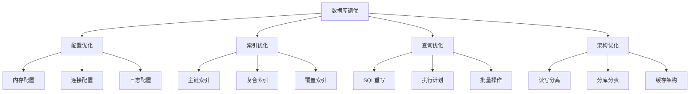

# 数据库调优

YYHertz框架下的数据库性能调优指南，涵盖MySQL/PostgreSQL的配置优化、索引设计、查询优化等关键技术。

## 🎯 调优目标

### 性能指标基准

| 指标类型 | MySQL目标值 | PostgreSQL目标值 | 说明 |
|----------|-------------|------------------|------|
| **响应延迟** | P95 < 50ms | P95 < 50ms | 95%查询在50ms内完成 |
| **吞吐量** | >5000 QPS | >4000 QPS | 每秒查询处理能力 |
| **连接数** | 200-500 | 100-300 | 同时连接数范围 |
| **CPU使用率** | < 80% | < 80% | 峰值时期CPU占用 |
| **内存使用率** | < 85% | < 85% | 缓冲池内存占用 |

### 调优优先级



## 🔧 MySQL调优

### 1. 配置文件优化

#### 基础配置 (`my.cnf`)

```ini
[mysql]
default-character-set = utf8mb4

[mysqld]
# === 基础设置 ===
port = 3306
server-id = 1
character-set-server = utf8mb4
collation-server = utf8mb4_unicode_ci

# === 内存配置 ===
# InnoDB缓冲池大小（推荐为物理内存的70-80%）
innodb_buffer_pool_size = 4G
innodb_buffer_pool_instances = 4

# 查询缓存（MySQL 8.0已移除）
query_cache_type = OFF
query_cache_size = 0

# 排序缓冲区
sort_buffer_size = 2M
read_buffer_size = 1M
read_rnd_buffer_size = 4M
join_buffer_size = 2M

# === 连接配置 ===
max_connections = 500
max_connect_errors = 100
connect_timeout = 10
wait_timeout = 300
interactive_timeout = 300

# === InnoDB配置 ===
innodb_file_per_table = ON
innodb_flush_log_at_trx_commit = 1
innodb_log_file_size = 256M
innodb_log_files_in_group = 3
innodb_io_capacity = 200
innodb_io_capacity_max = 2000

# === 慢查询日志 ===
slow_query_log = ON
slow_query_log_file = /var/log/mysql/mysql-slow.log
long_query_time = 0.5
log_queries_not_using_indexes = ON
```

#### 高性能配置 (`production.cnf`)

```ini
[mysqld]
# === 高性能设置 ===
# 跳过名称解析
skip_name_resolve = ON

# 禁用DNS查找
skip_host_cache = ON

# 二进制日志
log-bin = mysql-bin
binlog_format = ROW
expire_logs_days = 7
max_binlog_size = 1G

# === 高级InnoDB设置 ===
# 刷新策略
innodb_flush_method = O_DIRECT
innodb_doublewrite = ON

# 并发控制
innodb_thread_concurrency = 0
innodb_read_io_threads = 4
innodb_write_io_threads = 4

# 锁等待超时
innodb_lock_wait_timeout = 50

# === 性能模式 ===
performance_schema = ON
performance_schema_max_table_instances = 12500
```

### 2. 索引设计与优化

#### 索引设计原则

```sql
-- ✅ 好的索引设计
CREATE TABLE users (
    id BIGINT PRIMARY KEY AUTO_INCREMENT,
    email VARCHAR(255) NOT NULL,
    status TINYINT NOT NULL DEFAULT 1,
    created_at TIMESTAMP DEFAULT CURRENT_TIMESTAMP,
    updated_at TIMESTAMP DEFAULT CURRENT_TIMESTAMP ON UPDATE CURRENT_TIMESTAMP,
    
    -- 单列索引
    INDEX idx_email (email),
    INDEX idx_status (status),
    INDEX idx_created_at (created_at),
    
    -- 复合索引（重要：顺序很关键）
    INDEX idx_status_created (status, created_at),
    INDEX idx_email_status (email, status),
    
    -- 唯一索引
    UNIQUE KEY uk_email (email)
);

-- ❌ 避免的索引设计
-- 过多的单列索引会影响写入性能
-- 重复或冗余的索引
-- 在小表上建立过多索引
```

#### 索引优化策略

```sql
-- 1. 覆盖索引优化
-- 原查询需要回表
SELECT id, name, email FROM users WHERE status = 1 ORDER BY created_at;

-- 创建覆盖索引避免回表
CREATE INDEX idx_status_created_cover (status, created_at, id, name, email);

-- 2. 前缀索引优化
-- 对于长字符串字段，使用前缀索引
CREATE INDEX idx_description_prefix (description(50));

-- 3. 条件索引（MySQL 8.0+）
CREATE INDEX idx_active_users (created_at) WHERE status = 1;

-- 4. 索引提示优化
SELECT /*+ USE INDEX(idx_status_created) */ * 
FROM users 
WHERE status = 1 AND created_at > '2024-01-01';
```

### 3. SQL查询优化

#### 查询重写技巧

```sql
-- ❌ 低效查询
SELECT * FROM users WHERE YEAR(created_at) = 2024;
SELECT * FROM users WHERE name LIKE '%john%';
SELECT * FROM orders WHERE user_id IN (SELECT id FROM users WHERE status = 1);

-- ✅ 优化后查询
-- 避免函数操作，使用范围查询
SELECT * FROM users 
WHERE created_at >= '2024-01-01' AND created_at < '2025-01-01';

-- 前缀匹配，可以使用索引
SELECT * FROM users WHERE name LIKE 'john%';

-- 使用JOIN替代子查询
SELECT o.* FROM orders o 
INNER JOIN users u ON o.user_id = u.id 
WHERE u.status = 1;
```

#### 批量操作优化

```go
// YYHertz框架中的批量优化示例
func (c *UserController) PostBatchCreate() {
    ctx := context.Background()
    
    var users []User
    if err := c.ShouldBindJSON(&users); err != nil {
        c.Error(400, "参数错误")
        return
    }
    
    // 批量插入优化
    batchSize := 1000
    for i := 0; i < len(users); i += batchSize {
        end := i + batchSize
        if end > len(users) {
            end = len(users)
        }
        
        batch := users[i:end]
        
        // 使用事务批量插入
        err := c.db.Transaction(func(tx *gorm.DB) error {
            return tx.CreateInBatches(batch, batchSize).Error
        })
        
        if err != nil {
            c.Error(500, "批量插入失败")
            return
        }
    }
    
    c.JSON(mvc.Result{Success: true, Data: len(users)})
}
```

## 🐘 PostgreSQL调优

### 1. 配置优化

#### `postgresql.conf` 基础配置

```ini
# === 内存配置 ===
shared_buffers = 1GB                    # 推荐为物理内存的25%
effective_cache_size = 3GB              # 推荐为物理内存的75%
work_mem = 4MB                          # 排序/哈希操作内存
maintenance_work_mem = 256MB            # 维护操作内存

# === 检查点配置 ===
checkpoint_completion_target = 0.7      # 检查点完成时间
wal_buffers = 16MB                      # WAL缓冲区
max_wal_size = 2GB                      # 最大WAL大小
min_wal_size = 512MB                    # 最小WAL大小

# === 连接配置 ===
max_connections = 200                    # 最大连接数
shared_preload_libraries = 'pg_stat_statements'

# === 查询计划 ===
random_page_cost = 1.1                  # SSD存储建议值
effective_io_concurrency = 200          # SSD并发IO

# === 日志配置 ===
logging_collector = on
log_directory = 'pg_log'
log_filename = 'postgresql-%Y-%m-%d_%H%M%S.log'
log_min_duration_statement = 1000       # 记录超过1秒的查询
log_statement = 'mod'                   # 记录修改语句
```

### 2. 索引策略

#### PostgreSQL特有索引类型

```sql
-- B-tree索引（默认）
CREATE INDEX idx_users_email ON users(email);

-- 部分索引
CREATE INDEX idx_active_users ON users(created_at) WHERE status = 'active';

-- 表达式索引
CREATE INDEX idx_users_lower_name ON users(lower(name));

-- GIN索引（适合数组、JSON、全文搜索）
CREATE INDEX idx_users_tags ON users USING gin(tags);

-- GiST索引（适合几何数据、范围类型）
CREATE INDEX idx_users_location ON users USING gist(location);

-- 复合索引（注意列顺序）
CREATE INDEX idx_users_status_created ON users(status, created_at);
```

### 3. 查询优化

#### EXPLAIN分析

```sql
-- 基础执行计划
EXPLAIN SELECT * FROM users WHERE status = 'active';

-- 详细分析（包含实际执行时间）
EXPLAIN (ANALYZE, BUFFERS, VERBOSE) 
SELECT u.name, COUNT(o.id) as order_count
FROM users u
LEFT JOIN orders o ON u.id = o.user_id
WHERE u.status = 'active'
GROUP BY u.id, u.name
ORDER BY order_count DESC;
```

## 📊 YYHertz框架中的数据库监控

### 1. 性能监控集成

```go
package monitoring

import (
    "context"
    "time"
    "github.com/prometheus/client_golang/prometheus"
    "gorm.io/gorm"
)

// 数据库性能指标
var (
    dbQueryDuration = prometheus.NewHistogramVec(
        prometheus.HistogramOpts{
            Name: "db_query_duration_seconds",
            Help: "Database query duration",
            Buckets: []float64{0.001, 0.005, 0.01, 0.05, 0.1, 0.5, 1.0, 5.0},
        },
        []string{"operation", "table"},
    )
    
    dbQueryTotal = prometheus.NewCounterVec(
        prometheus.CounterOpts{
            Name: "db_queries_total",
            Help: "Total database queries",
        },
        []string{"operation", "table", "status"},
    )
)

// GORM插件：监控数据库查询
func NewMonitoringPlugin() gorm.Plugin {
    return &monitoringPlugin{}
}

type monitoringPlugin struct{}

func (p *monitoringPlugin) Name() string {
    return "monitoring"
}

func (p *monitoringPlugin) Initialize(db *gorm.DB) error {
    // 注册回调
    db.Callback().Query().Before("gorm:query").Register("monitoring:before_query", beforeQuery)
    db.Callback().Query().After("gorm:after_query").Register("monitoring:after_query", afterQuery)
    
    return nil
}

func beforeQuery(db *gorm.DB) {
    db.Set("monitoring:start_time", time.Now())
}

func afterQuery(db *gorm.DB) {
    startTime, exists := db.Get("monitoring:start_time")
    if !exists {
        return
    }
    
    duration := time.Since(startTime.(time.Time))
    
    // 记录指标
    operation := "select"
    table := db.Statement.Table
    status := "success"
    
    if db.Error != nil {
        status = "error"
    }
    
    dbQueryDuration.WithLabelValues(operation, table).Observe(duration.Seconds())
    dbQueryTotal.WithLabelValues(operation, table, status).Inc()
}
```

### 2. 慢查询监控

```go
// 慢查询监控中间件
func SlowQueryMiddleware(threshold time.Duration) gorm.Plugin {
    return &slowQueryPlugin{threshold: threshold}
}

type slowQueryPlugin struct {
    threshold time.Duration
}

func (p *slowQueryPlugin) Name() string {
    return "slow_query"
}

func (p *slowQueryPlugin) Initialize(db *gorm.DB) error {
    db.Callback().Query().After("gorm:query").Register("slow_query:after", func(db *gorm.DB) {
        elapsed := db.Statement.Context.Value("query_start_time")
        if elapsed == nil {
            return
        }
        
        duration := time.Since(elapsed.(time.Time))
        if duration > p.threshold {
            logrus.WithFields(logrus.Fields{
                "sql":      db.Statement.SQL.String(),
                "args":     db.Statement.Vars,
                "duration": duration.String(),
                "table":    db.Statement.Table,
            }).Warn("慢查询检测")
        }
    })
    
    return nil
}
```

## 🔧 架构层面优化

### 1. 读写分离配置

```go
// 读写分离配置
type DatabaseConfig struct {
    Master DatabaseConnection `yaml:"master"`
    Slaves []DatabaseConnection `yaml:"slaves"`
}

type DatabaseConnection struct {
    Host     string `yaml:"host"`
    Port     int    `yaml:"port"`
    Database string `yaml:"database"`
    Username string `yaml:"username"`
    Password string `yaml:"password"`
    MaxOpenConns int `yaml:"max_open_conns"`
    MaxIdleConns int `yaml:"max_idle_conns"`
}

// 使用读写分离
func SetupReadWriteDB(config DatabaseConfig) (*gorm.DB, error) {
    // 主库配置
    masterDSN := fmt.Sprintf("%s:%s@tcp(%s:%d)/%s?charset=utf8mb4&parseTime=True&loc=Local",
        config.Master.Username, config.Master.Password,
        config.Master.Host, config.Master.Port, config.Master.Database)
    
    masterDB, err := gorm.Open(mysql.Open(masterDSN), &gorm.Config{})
    if err != nil {
        return nil, err
    }
    
    // 从库配置
    var slaveDSNs []gorm.Dialector
    for _, slave := range config.Slaves {
        dsn := fmt.Sprintf("%s:%s@tcp(%s:%d)/%s?charset=utf8mb4&parseTime=True&loc=Local",
            slave.Username, slave.Password,
            slave.Host, slave.Port, slave.Database)
        slaveDSNs = append(slaveDSNs, mysql.Open(dsn))
    }
    
    // 使用DBResolver插件实现读写分离
    err = masterDB.Use(dbresolver.Register(dbresolver.Config{
        Replicas: slaveDSNs,
        Policy: dbresolver.RandomPolicy{}, // 随机选择从库
    }))
    
    return masterDB, err
}
```

### 2. 连接池优化

```yaml
# conf/database.yaml
master:
  host: "master.mysql.internal"
  port: 3306
  database: "yyhertz_prod"
  username: "app_user"
  password: "${DB_PASSWORD}"
  
  # 连接池优化配置
  max_open_conns: 100              # 最大打开连接数
  max_idle_conns: 50               # 最大空闲连接数  
  conn_max_lifetime: "1h"          # 连接最大生存时间
  conn_max_idle_time: "30m"        # 连接最大空闲时间
  
  # 超时配置
  dial_timeout: "5s"               # 连接超时
  read_timeout: "30s"              # 读取超时
  write_timeout: "30s"             # 写入超时

slaves:
  - host: "slave1.mysql.internal"
    port: 3306
    max_open_conns: 50
    max_idle_conns: 25
  - host: "slave2.mysql.internal"
    port: 3306
    max_open_conns: 50
    max_idle_conns: 25
```

## 📈 性能测试与基准

### 1. 数据库压力测试

```bash
# 使用sysbench进行MySQL压力测试
# 安装sysbench
sudo apt install sysbench

# 准备测试数据
sysbench oltp_read_write \
    --mysql-host=localhost \
    --mysql-port=3306 \
    --mysql-user=test \
    --mysql-password=test \
    --mysql-db=testdb \
    --tables=10 \
    --table-size=100000 \
    prepare

# 运行测试
sysbench oltp_read_write \
    --mysql-host=localhost \
    --mysql-port=3306 \
    --mysql-user=test \
    --mysql-password=test \
    --mysql-db=testdb \
    --tables=10 \
    --table-size=100000 \
    --threads=64 \
    --time=300 \
    --report-interval=10 \
    run
```

### 2. Go应用层压力测试

```go
// 数据库性能测试
func BenchmarkDatabaseOperations(b *testing.B) {
    db := setupTestDB()
    
    b.Run("SelectUser", func(b *testing.B) {
        b.ResetTimer()
        for i := 0; i < b.N; i++ {
            var user User
            db.First(&user, 1)
        }
    })
    
    b.Run("SelectUserList", func(b *testing.B) {
        b.ResetTimer()
        for i := 0; i < b.N; i++ {
            var users []User
            db.Limit(10).Find(&users)
        }
    })
    
    b.Run("CreateUser", func(b *testing.B) {
        b.ResetTimer()
        for i := 0; i < b.N; i++ {
            user := User{
                Name:  fmt.Sprintf("test_user_%d", i),
                Email: fmt.Sprintf("test_%d@example.com", i),
            }
            db.Create(&user)
        }
    })
}
```

## 🚨 告警与监控

### 1. 关键指标告警规则

```yaml
# Prometheus告警规则
groups:
  - name: database
    rules:
      # 数据库连接数告警
      - alert: DatabaseHighConnections
        expr: mysql_global_status_threads_connected / mysql_global_variables_max_connections > 0.8
        for: 2m
        labels:
          severity: warning
        annotations:
          summary: "数据库连接数过高"
          description: "数据库连接使用率超过80%，当前: {{ $value }}%"
      
      # 慢查询告警
      - alert: DatabaseSlowQueries
        expr: increase(mysql_global_status_slow_queries[5m]) > 10
        for: 1m
        labels:
          severity: warning
        annotations:
          summary: "慢查询数量异常"
          description: "5分钟内慢查询超过10个"
      
      # 数据库可用性告警
      - alert: DatabaseDown
        expr: mysql_up == 0
        for: 1m
        labels:
          severity: critical
        annotations:
          summary: "数据库不可用"
          description: "MySQL数据库连接失败"
```

### 2. 监控面板配置

```json
{
  "dashboard": {
    "title": "数据库性能监控",
    "panels": [
      {
        "title": "QPS (Queries Per Second)",
        "type": "graph",
        "targets": [
          {
            "expr": "rate(mysql_global_status_questions[5m])",
            "legendFormat": "QPS"
          }
        ]
      },
      {
        "title": "连接数使用情况",
        "type": "graph",
        "targets": [
          {
            "expr": "mysql_global_status_threads_connected",
            "legendFormat": "活跃连接"
          },
          {
            "expr": "mysql_global_variables_max_connections",
            "legendFormat": "最大连接数"
          }
        ]
      },
      {
        "title": "查询延迟分布",
        "type": "heatmap",
        "targets": [
          {
            "expr": "increase(db_query_duration_seconds_bucket[5m])",
            "legendFormat": "{{le}}"
          }
        ]
      }
    ]
  }
}
```

## 📚 相关资源

- **[MyBatis性能优化](./mybatis-performance.md)** - 应用层数据访问优化
- **[缓存策略](./caching-strategies.md)** - Redis缓存设计最佳实践
- **[监控告警](./monitoring-alerting.md)** - 完整的监控告警解决方案

---

**数据库调优是系统性工程** - 需要从配置、索引、查询、架构等多个维度综合优化，持续监控和调整！🚀