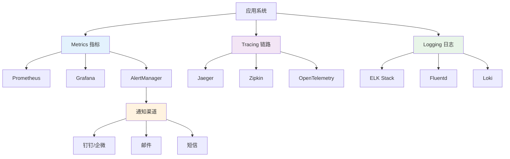

# 监控告警

YYHertz框架的完整可观测性解决方案，包含指标收集、链路追踪、日志聚合、告警通知等核心能力。

## 🎯 可观测性架构

### 三大支柱体系



### 监控层次结构

| 监控层级 | 监控对象 | 关键指标 | 告警阈值 | 响应时间 |
|----------|----------|----------|----------|----------|
| **基础设施** | 服务器、网络 | CPU、内存、磁盘、网络 | CPU>80%, 内存>85% | 立即 |
| **中间件** | Redis、MySQL、MQ | 连接数、QPS、延迟 | 连接>80%, 延迟>100ms | 2分钟 |
| **应用服务** | HTTP、RPC | 请求量、错误率、响应时间 | 错误率>5%, RT>1s | 1分钟 |
| **业务功能** | 用户行为、业务流程 | 转化率、成功率 | 根据业务定制 | 5分钟 |

## 📊 Prometheus指标收集

### 1. YYHertz框架指标集成

#### `framework/monitoring/prometheus.go`

```go
package monitoring

import (
    "strconv"
    "time"
    
    "github.com/prometheus/client_golang/prometheus"
    "github.com/prometheus/client_golang/prometheus/promhttp"
    "github.com/cloudwego/hertz/pkg/app"
    "github.com/cloudwego/hertz/pkg/common/hlog"
)

// Prometheus指标定义
var (
    // HTTP请求指标
    HTTPRequestsTotal = prometheus.NewCounterVec(
        prometheus.CounterOpts{
            Name: "http_requests_total",
            Help: "Total number of HTTP requests",
        },
        []string{"method", "path", "status_code"},
    )
    
    HTTPRequestDuration = prometheus.NewHistogramVec(
        prometheus.HistogramOpts{
            Name: "http_request_duration_seconds",
            Help: "HTTP request duration",
            Buckets: []float64{0.01, 0.05, 0.1, 0.25, 0.5, 1, 2.5, 5, 10},
        },
        []string{"method", "path"},
    )
    
    HTTPRequestsInFlight = prometheus.NewGauge(
        prometheus.GaugeOpts{
            Name: "http_requests_in_flight",
            Help: "Current number of HTTP requests being processed",
        },
    )
    
    // 数据库指标
    DBConnectionsInUse = prometheus.NewGauge(
        prometheus.GaugeOpts{
            Name: "db_connections_in_use",
            Help: "Number of database connections in use",
        },
    )
    
    DBQueryDuration = prometheus.NewHistogramVec(
        prometheus.HistogramOpts{
            Name: "db_query_duration_seconds",
            Help: "Database query duration",
            Buckets: []float64{0.001, 0.005, 0.01, 0.05, 0.1, 0.5, 1.0},
        },
        []string{"operation", "table"},
    )
    
    // Redis指标
    RedisOperationDuration = prometheus.NewHistogramVec(
        prometheus.HistogramOpts{
            Name: "redis_operation_duration_seconds",
            Help: "Redis operation duration",
            Buckets: []float64{0.001, 0.005, 0.01, 0.05, 0.1, 0.5, 1.0},
        },
        []string{"command"},
    )
    
    // 自定义业务指标
    UserLoginTotal = prometheus.NewCounterVec(
        prometheus.CounterOpts{
            Name: "user_login_total",
            Help: "Total user login attempts",
        },
        []string{"status", "method"},
    )
    
    ActiveUsers = prometheus.NewGauge(
        prometheus.GaugeOpts{
            Name: "active_users",
            Help: "Current number of active users",
        },
    )
)

// 注册所有指标
func init() {
    prometheus.MustRegister(
        HTTPRequestsTotal,
        HTTPRequestDuration,
        HTTPRequestsInFlight,
        DBConnectionsInUse,
        DBQueryDuration,
        RedisOperationDuration,
        UserLoginTotal,
        ActiveUsers,
    )
}

// Prometheus监控中间件
func PrometheusMiddleware() app.HandlerFunc {
    return func(ctx context.Context, c *app.RequestContext) {
        start := time.Now()
        path := string(c.Path())
        method := string(c.Method())
        
        // 增加正在处理的请求数
        HTTPRequestsInFlight.Inc()
        defer HTTPRequestsInFlight.Dec()
        
        // 处理请求
        c.Next(ctx)
        
        // 记录指标
        duration := time.Since(start).Seconds()
        statusCode := strconv.Itoa(c.Response.StatusCode())
        
        HTTPRequestsTotal.WithLabelValues(method, path, statusCode).Inc()
        HTTPRequestDuration.WithLabelValues(method, path).Observe(duration)
        
        // 记录慢请求
        if duration > 1.0 {
            hlog.CtxWarnf(ctx, "慢请求: %s %s 耗时: %.3fs", method, path, duration)
        }
    }
}

// 业务指标记录器
type BusinessMetrics struct{}

// 记录用户登录
func (bm *BusinessMetrics) RecordUserLogin(status, method string) {
    UserLoginTotal.WithLabelValues(status, method).Inc()
}

// 更新活跃用户数
func (bm *BusinessMetrics) UpdateActiveUsers(count float64) {
    ActiveUsers.Set(count)
}

// 启动指标收集定时任务
func (bm *BusinessMetrics) StartMetricsCollection() {
    ticker := time.NewTicker(30 * time.Second)
    go func() {
        for {
            select {
            case <-ticker.C:
                bm.collectBusinessMetrics()
            }
        }
    }()
}

func (bm *BusinessMetrics) collectBusinessMetrics() {
    // 这里实现具体的业务指标收集逻辑
    // 例如：查询数据库获取活跃用户数
    // activeCount := getUserActiveCount()
    // ActiveUsers.Set(float64(activeCount))
}
```

### 2. 自定义指标收集器

```go
// 自定义收集器
type CustomCollector struct {
    db          *gorm.DB
    redis       *redis.Client
    metricDescs []*prometheus.Desc
}

func NewCustomCollector(db *gorm.DB, redis *redis.Client) *CustomCollector {
    return &CustomCollector{
        db:    db,
        redis: redis,
        metricDescs: []*prometheus.Desc{
            prometheus.NewDesc(
                "yyhertz_total_users",
                "Total number of registered users",
                nil, nil,
            ),
            prometheus.NewDesc(
                "yyhertz_online_users",
                "Number of online users",
                nil, nil,
            ),
            prometheus.NewDesc(
                "yyhertz_orders_today",
                "Number of orders created today",
                nil, nil,
            ),
        },
    }
}

// 实现Collector接口
func (c *CustomCollector) Describe(ch chan<- *prometheus.Desc) {
    for _, desc := range c.metricDescs {
        ch <- desc
    }
}

func (c *CustomCollector) Collect(ch chan<- prometheus.Metric) {
    // 收集用户总数
    var totalUsers int64
    c.db.Model(&User{}).Count(&totalUsers)
    ch <- prometheus.MustNewConstMetric(
        c.metricDescs[0],
        prometheus.GaugeValue,
        float64(totalUsers),
    )
    
    // 收集在线用户数
    onlineUsers, _ := c.redis.SCard(context.Background(), "online_users").Result()
    ch <- prometheus.MustNewConstMetric(
        c.metricDescs[1],
        prometheus.GaugeValue,
        float64(onlineUsers),
    )
    
    // 收集今日订单数
    var todayOrders int64
    today := time.Now().Format("2006-01-02")
    c.db.Model(&Order{}).
        Where("DATE(created_at) = ?", today).
        Count(&todayOrders)
    ch <- prometheus.MustNewConstMetric(
        c.metricDescs[2],
        prometheus.GaugeValue,
        float64(todayOrders),
    )
}
```

## 🔍 链路追踪集成

### 1. OpenTelemetry配置

```go
package tracing

import (
    "context"
    "go.opentelemetry.io/otel"
    "go.opentelemetry.io/otel/exporters/jaeger"
    "go.opentelemetry.io/otel/sdk/resource"
    "go.opentelemetry.io/otel/sdk/trace"
    "go.opentelemetry.io/otel/semconv/v1.4.0"
)

// 初始化链路追踪
func InitTracing(serviceName, jaegerEndpoint string) (func(), error) {
    // 创建Jaeger导出器
    exp, err := jaeger.New(jaeger.WithCollectorEndpoint(
        jaeger.WithEndpoint(jaegerEndpoint),
    ))
    if err != nil {
        return nil, err
    }
    
    // 创建TracerProvider
    tp := trace.NewTracerProvider(
        trace.WithBatcher(exp),
        trace.WithResource(resource.NewWithAttributes(
            semconv.SchemaURL,
            semconv.ServiceNameKey.String(serviceName),
            semconv.ServiceVersionKey.String("1.0.0"),
        )),
    )
    
    otel.SetTracerProvider(tp)
    
    return func() {
        tp.Shutdown(context.Background())
    }, nil
}

// 链路追踪中间件
func TracingMiddleware(serviceName string) app.HandlerFunc {
    tracer := otel.Tracer(serviceName)
    
    return func(ctx context.Context, c *app.RequestContext) {
        spanCtx, span := tracer.Start(ctx, string(c.Path()))
        defer span.End()
        
        // 设置span属性
        span.SetAttributes(
            attribute.String("http.method", string(c.Method())),
            attribute.String("http.url", string(c.URI().FullURI())),
            attribute.String("http.user_agent", string(c.UserAgent())),
        )
        
        // 传递trace上下文
        c.Set("trace_context", spanCtx)
        
        c.Next(spanCtx)
        
        // 设置响应属性
        span.SetAttributes(
            attribute.Int("http.status_code", c.Response.StatusCode()),
            attribute.Int64("http.response_size", int64(c.Response.Header.ContentLength())),
        )
    }
}

// 数据库链路追踪
func DatabaseTracingPlugin(serviceName string) gorm.Plugin {
    return &dbTracingPlugin{
        tracer: otel.Tracer(serviceName),
    }
}

type dbTracingPlugin struct {
    tracer trace.Tracer
}

func (p *dbTracingPlugin) Name() string {
    return "tracing"
}

func (p *dbTracingPlugin) Initialize(db *gorm.DB) error {
    db.Callback().Query().Before("gorm:query").Register("tracing:before_query", p.beforeQuery)
    db.Callback().Query().After("gorm:query").Register("tracing:after_query", p.afterQuery)
    return nil
}

func (p *dbTracingPlugin) beforeQuery(db *gorm.DB) {
    ctx := db.Statement.Context
    _, span := p.tracer.Start(ctx, "db.query")
    
    span.SetAttributes(
        attribute.String("db.statement", db.Statement.SQL.String()),
        attribute.String("db.table", db.Statement.Table),
        attribute.String("db.operation", "select"),
    )
    
    db.Statement.Context = trace.ContextWithSpan(ctx, span)
}

func (p *dbTracingPlugin) afterQuery(db *gorm.DB) {
    span := trace.SpanFromContext(db.Statement.Context)
    defer span.End()
    
    if db.Error != nil {
        span.SetAttributes(attribute.String("db.error", db.Error.Error()))
        span.SetStatus(codes.Error, db.Error.Error())
    } else {
        span.SetAttributes(attribute.Int64("db.rows_affected", db.RowsAffected))
        span.SetStatus(codes.Ok, "")
    }
}
```

## 📝 日志聚合

### 1. 结构化日志配置

```go
package logging

import (
    "context"
    "os"
    "github.com/sirupsen/logrus"
    "go.opentelemetry.io/otel/trace"
)

// 日志配置
type LogConfig struct {
    Level      string `yaml:"level"`
    Format     string `yaml:"format"`  // json, text
    Output     string `yaml:"output"`  // stdout, file
    FilePath   string `yaml:"file_path"`
    MaxSize    int    `yaml:"max_size"`    // MB
    MaxBackups int    `yaml:"max_backups"`
    MaxAge     int    `yaml:"max_age"`     // days
}

// 初始化结构化日志
func InitLogger(config *LogConfig) *logrus.Logger {
    logger := logrus.New()
    
    // 设置日志级别
    level, err := logrus.ParseLevel(config.Level)
    if err != nil {
        level = logrus.InfoLevel
    }
    logger.SetLevel(level)
    
    // 设置日志格式
    if config.Format == "json" {
        logger.SetFormatter(&logrus.JSONFormatter{
            TimestampFormat: "2006-01-02 15:04:05.000",
            FieldMap: logrus.FieldMap{
                logrus.FieldKeyTime:  "timestamp",
                logrus.FieldKeyLevel: "level",
                logrus.FieldKeyMsg:   "message",
            },
        })
    } else {
        logger.SetFormatter(&logrus.TextFormatter{
            TimestampFormat: "2006-01-02 15:04:05.000",
            FullTimestamp:   true,
        })
    }
    
    // 设置输出
    if config.Output == "file" {
        // 使用文件轮转
        setupFileRotation(logger, config)
    } else {
        logger.SetOutput(os.Stdout)
    }
    
    return logger
}

// 链路追踪日志钩子
type TracingHook struct{}

func (hook *TracingHook) Levels() []logrus.Level {
    return logrus.AllLevels
}

func (hook *TracingHook) Fire(entry *logrus.Entry) error {
    if entry.Context != nil {
        span := trace.SpanFromContext(entry.Context)
        if span.SpanContext().IsValid() {
            entry.Data["trace_id"] = span.SpanContext().TraceID().String()
            entry.Data["span_id"] = span.SpanContext().SpanID().String()
        }
    }
    return nil
}

// 业务日志包装器
type BusinessLogger struct {
    logger *logrus.Logger
}

func NewBusinessLogger(logger *logrus.Logger) *BusinessLogger {
    logger.AddHook(&TracingHook{})
    return &BusinessLogger{logger: logger}
}

// 用户操作日志
func (bl *BusinessLogger) LogUserAction(ctx context.Context, userID int64, action, details string) {
    bl.logger.WithContext(ctx).WithFields(logrus.Fields{
        "user_id": userID,
        "action":  action,
        "details": details,
        "type":    "user_action",
    }).Info("用户操作")
}

// 业务异常日志
func (bl *BusinessLogger) LogBusinessError(ctx context.Context, err error, operation string, params map[string]interface{}) {
    fields := logrus.Fields{
        "error":     err.Error(),
        "operation": operation,
        "type":      "business_error",
    }
    
    for k, v := range params {
        fields[k] = v
    }
    
    bl.logger.WithContext(ctx).WithFields(fields).Error("业务异常")
}

// 性能日志
func (bl *BusinessLogger) LogPerformance(ctx context.Context, operation string, duration time.Duration, params map[string]interface{}) {
    fields := logrus.Fields{
        "operation": operation,
        "duration":  duration.Milliseconds(),
        "type":      "performance",
    }
    
    for k, v := range params {
        fields[k] = v
    }
    
    level := logrus.InfoLevel
    if duration > time.Second {
        level = logrus.WarnLevel
    }
    
    bl.logger.WithContext(ctx).WithFields(fields).Log(level, "性能记录")
}
```

### 2. ELK Stack集成

```yaml
# docker-compose.yml - ELK Stack
version: '3.8'
services:
  elasticsearch:
    image: docker.elastic.co/elasticsearch/elasticsearch:8.11.0
    environment:
      - discovery.type=single-node
      - "ES_JAVA_OPTS=-Xms1g -Xmx1g"
      - xpack.security.enabled=false
    ports:
      - "9200:9200"
    volumes:
      - es_data:/usr/share/elasticsearch/data

  logstash:
    image: docker.elastic.co/logstash/logstash:8.11.0
    ports:
      - "5044:5044"
      - "9600:9600"
    volumes:
      - ./logstash.conf:/usr/share/logstash/pipeline/logstash.conf
    depends_on:
      - elasticsearch

  kibana:
    image: docker.elastic.co/kibana/kibana:8.11.0
    ports:
      - "5601:5601"
    environment:
      ELASTICSEARCH_HOSTS: http://elasticsearch:9200
    depends_on:
      - elasticsearch

  filebeat:
    image: docker.elastic.co/beats/filebeat:8.11.0
    volumes:
      - ./filebeat.yml:/usr/share/filebeat/filebeat.yml:ro
      - /var/log/yyhertz:/var/log/yyhertz:ro
    depends_on:
      - logstash

volumes:
  es_data:
```

```yaml
# filebeat.yml
filebeat.inputs:
  - type: log
    enabled: true
    paths:
      - /var/log/yyhertz/*.log
    fields:
      service: yyhertz
      environment: production
    fields_under_root: true
    json.keys_under_root: true
    json.add_error_key: true

output.logstash:
  hosts: ["logstash:5044"]

processors:
  - add_host_metadata:
      when.not.contains.tags: forwarded
```

## 🚨 告警配置

### 1. AlertManager配置

```yaml
# alertmanager.yml
global:
  smtp_smarthost: 'smtp.company.com:587'
  smtp_from: 'alerts@company.com'
  smtp_auth_username: 'alerts@company.com'
  smtp_auth_password: 'password'

templates:
  - '/etc/alertmanager/templates/*.tmpl'

route:
  group_by: ['alertname', 'cluster', 'service']
  group_wait: 10s
  group_interval: 10s
  repeat_interval: 1h
  receiver: 'default'
  routes:
    - match:
        severity: critical
      receiver: 'critical-alerts'
    - match:
        severity: warning
      receiver: 'warning-alerts'

receivers:
  - name: 'default'
    webhook_configs:
      - url: 'http://webhook-service:8080/alerts'
        
  - name: 'critical-alerts'
    email_configs:
      - to: 'ops-team@company.com'
        subject: '🚨 [CRITICAL] YYHertz Alert'
        body: |
          {{ range .Alerts }}
          Alert: {{ .Annotations.summary }}
          Description: {{ .Annotations.description }}
          {{ end }}
    webhook_configs:
      - url: 'http://dingtalk-webhook:8080/critical'
        
  - name: 'warning-alerts'
    email_configs:
      - to: 'dev-team@company.com'
        subject: '⚠️ [WARNING] YYHertz Alert'

inhibit_rules:
  - source_match:
      severity: 'critical'
    target_match:
      severity: 'warning'
    equal: ['alertname', 'cluster', 'service']
```

### 2. Prometheus告警规则

```yaml
# alert-rules.yml
groups:
  - name: yyhertz-application
    rules:
      # HTTP错误率告警
      - alert: HighErrorRate
        expr: |
          (
            sum(rate(http_requests_total{status_code=~"5.."}[5m])) by (service)
            /
            sum(rate(http_requests_total[5m])) by (service)
          ) > 0.05
        for: 2m
        labels:
          severity: warning
        annotations:
          summary: "高错误率告警"
          description: "服务 {{ $labels.service }} 5分钟内错误率超过5%，当前值: {{ $value | humanizePercentage }}"

      - alert: CriticalErrorRate
        expr: |
          (
            sum(rate(http_requests_total{status_code=~"5.."}[5m])) by (service)
            /
            sum(rate(http_requests_total[5m])) by (service)
          ) > 0.1
        for: 1m
        labels:
          severity: critical
        annotations:
          summary: "严重错误率告警"
          description: "服务 {{ $labels.service }} 错误率超过10%，当前值: {{ $value | humanizePercentage }}"

      # 响应延迟告警
      - alert: HighLatency
        expr: |
          histogram_quantile(0.95, 
            sum(rate(http_request_duration_seconds_bucket[5m])) by (le, service)
          ) > 1
        for: 5m
        labels:
          severity: warning
        annotations:
          summary: "高延迟告警"
          description: "服务 {{ $labels.service }} P95延迟超过1秒，当前值: {{ $value }}s"

      # 数据库连接数告警
      - alert: HighDBConnections
        expr: |
          db_connections_in_use / db_max_connections > 0.8
        for: 2m
        labels:
          severity: warning
        annotations:
          summary: "数据库连接数过高"
          description: "数据库连接使用率超过80%，当前: {{ $value | humanizePercentage }}"

      # Redis连接告警
      - alert: RedisConnectionFailed
        expr: |
          redis_connected_clients == 0
        for: 1m
        labels:
          severity: critical
        annotations:
          summary: "Redis连接失败"
          description: "Redis连接数为0，可能服务不可用"

      # 业务指标告警
      - alert: UserLoginFailureSpike
        expr: |
          increase(user_login_total{status="failed"}[5m]) > 100
        for: 1m
        labels:
          severity: warning
        annotations:
          summary: "用户登录失败激增"
          description: "5分钟内登录失败次数超过100次，可能存在异常"

  - name: yyhertz-infrastructure
    rules:
      # 系统资源告警
      - alert: HighCPUUsage
        expr: |
          100 - (avg by(instance) (irate(node_cpu_seconds_total{mode="idle"}[5m])) * 100) > 80
        for: 5m
        labels:
          severity: warning
        annotations:
          summary: "CPU使用率过高"
          description: "实例 {{ $labels.instance }} CPU使用率超过80%，当前: {{ $value }}%"

      - alert: HighMemoryUsage
        expr: |
          (1 - node_memory_MemAvailable_bytes / node_memory_MemTotal_bytes) * 100 > 85
        for: 5m
        labels:
          severity: warning
        annotations:
          summary: "内存使用率过高"
          description: "实例 {{ $labels.instance }} 内存使用率超过85%，当前: {{ $value }}%"

      - alert: DiskSpaceLow
        expr: |
          (1 - node_filesystem_avail_bytes / node_filesystem_size_bytes) * 100 > 90
        for: 10m
        labels:
          severity: critical
        annotations:
          summary: "磁盘空间不足"
          description: "实例 {{ $labels.instance }} 磁盘 {{ $labels.mountpoint }} 使用率超过90%"
```

### 3. 钉钉/企业微信告警集成

```go
// 告警通知服务
package alerting

import (
    "bytes"
    "encoding/json"
    "fmt"
    "net/http"
    "time"
)

// 钉钉机器人
type DingTalkBot struct {
    WebhookURL string
    Secret     string
}

type DingTalkMessage struct {
    MsgType  string                 `json:"msgtype"`
    Markdown *DingTalkMarkdown      `json:"markdown,omitempty"`
    At       *DingTalkAt           `json:"at,omitempty"`
}

type DingTalkMarkdown struct {
    Title string `json:"title"`
    Text  string `json:"text"`
}

type DingTalkAt struct {
    AtMobiles []string `json:"atMobiles"`
    IsAtAll   bool     `json:"isAtAll"`
}

func (dt *DingTalkBot) SendAlert(alert *Alert) error {
    message := &DingTalkMessage{
        MsgType: "markdown",
        Markdown: &DingTalkMarkdown{
            Title: fmt.Sprintf("🚨 %s", alert.AlertName),
            Text: fmt.Sprintf(`
### %s 告警通知

**告警级别**: %s
**服务名称**: %s
**告警时间**: %s
**告警描述**: %s

**详细信息**:
- Instance: %s
- Value: %s

[查看详情](%s)
            `,
                alert.AlertName,
                alert.Severity,
                alert.Service,
                alert.StartsAt.Format("2006-01-02 15:04:05"),
                alert.Description,
                alert.Instance,
                alert.Value,
                alert.GeneratorURL,
            ),
        },
    }
    
    if alert.Severity == "critical" {
        message.At = &DingTalkAt{IsAtAll: true}
    }
    
    return dt.sendMessage(message)
}

func (dt *DingTalkBot) sendMessage(message *DingTalkMessage) error {
    jsonData, err := json.Marshal(message)
    if err != nil {
        return err
    }
    
    resp, err := http.Post(dt.WebhookURL, "application/json", bytes.NewBuffer(jsonData))
    if err != nil {
        return err
    }
    defer resp.Body.Close()
    
    if resp.StatusCode != http.StatusOK {
        return fmt.Errorf("钉钉消息发送失败，状态码: %d", resp.StatusCode)
    }
    
    return nil
}

// 告警管理器
type AlertManager struct {
    dingTalk     *DingTalkBot
    wechat       *WeChatBot
    emailSender  *EmailSender
    alertHistory map[string]*Alert
}

func NewAlertManager() *AlertManager {
    return &AlertManager{
        dingTalk:     &DingTalkBot{WebhookURL: os.Getenv("DINGTALK_WEBHOOK")},
        wechat:       &WeChatBot{WebhookURL: os.Getenv("WECHAT_WEBHOOK")},
        emailSender:  NewEmailSender(),
        alertHistory: make(map[string]*Alert),
    }
}

func (am *AlertManager) HandleAlert(alert *Alert) error {
    // 检查告警抑制
    if am.shouldSuppress(alert) {
        return nil
    }
    
    // 记录告警历史
    am.alertHistory[alert.Fingerprint] = alert
    
    // 根据严重程度选择通知渠道
    switch alert.Severity {
    case "critical":
        // 严重告警：钉钉 + 企业微信 + 邮件 + 短信
        go am.dingTalk.SendAlert(alert)
        go am.wechat.SendAlert(alert)
        go am.emailSender.SendAlert(alert)
        go am.sendSMS(alert)
        
    case "warning":
        // 警告告警：钉钉 + 邮件
        go am.dingTalk.SendAlert(alert)
        go am.emailSender.SendAlert(alert)
        
    default:
        // 信息告警：仅钉钉
        go am.dingTalk.SendAlert(alert)
    }
    
    return nil
}

// 告警抑制逻辑
func (am *AlertManager) shouldSuppress(alert *Alert) bool {
    key := alert.Fingerprint
    
    // 检查是否在抑制时间内
    if lastAlert, exists := am.alertHistory[key]; exists {
        if time.Since(lastAlert.StartsAt) < 15*time.Minute {
            return true // 15分钟内相同告警，抑制
        }
    }
    
    return false
}
```

## 📊 Grafana仪表板

### 1. YYHertz应用监控仪表板

```json
{
  "dashboard": {
    "title": "YYHertz应用监控",
    "tags": ["yyhertz", "application"],
    "time": {
      "from": "now-1h",
      "to": "now"
    },
    "panels": [
      {
        "title": "请求量 (RPS)",
        "type": "graph",
        "gridPos": {"h": 8, "w": 12, "x": 0, "y": 0},
        "targets": [
          {
            "expr": "sum(rate(http_requests_total[1m])) by (service)",
            "legendFormat": "{{service}}"
          }
        ],
        "yAxes": [
          {"label": "Requests/sec", "min": 0}
        ]
      },
      {
        "title": "错误率",
        "type": "graph", 
        "gridPos": {"h": 8, "w": 12, "x": 12, "y": 0},
        "targets": [
          {
            "expr": "sum(rate(http_requests_total{status_code=~\"5..\"}[1m])) by (service) / sum(rate(http_requests_total[1m])) by (service)",
            "legendFormat": "{{service}} 错误率"
          }
        ],
        "yAxes": [
          {"label": "Error Rate", "max": 1, "min": 0}
        ],
        "alert": {
          "conditions": [
            {
              "query": {"params": ["A", "1m", "now"]},
              "reducer": {"params": [], "type": "last"},
              "evaluator": {"params": [0.05], "type": "gt"}
            }
          ],
          "executionErrorState": "alerting",
          "frequency": "10s",
          "handler": 1,
          "name": "高错误率告警",
          "noDataState": "no_data"
        }
      },
      {
        "title": "响应时间分布",
        "type": "heatmap",
        "gridPos": {"h": 8, "w": 24, "x": 0, "y": 8},
        "targets": [
          {
            "expr": "increase(http_request_duration_seconds_bucket[1m])",
            "legendFormat": "{{le}}"
          }
        ]
      },
      {
        "title": "数据库性能",
        "type": "graph",
        "gridPos": {"h": 8, "w": 12, "x": 0, "y": 16},
        "targets": [
          {
            "expr": "histogram_quantile(0.95, sum(rate(db_query_duration_seconds_bucket[1m])) by (le))",
            "legendFormat": "DB P95延迟"
          },
          {
            "expr": "sum(rate(db_query_total[1m]))",
            "legendFormat": "DB QPS"
          }
        ]
      },
      {
        "title": "Redis性能",
        "type": "graph",
        "gridPos": {"h": 8, "w": 12, "x": 12, "y": 16},
        "targets": [
          {
            "expr": "histogram_quantile(0.95, sum(rate(redis_operation_duration_seconds_bucket[1m])) by (le))",
            "legendFormat": "Redis P95延迟"
          }
        ]
      }
    ]
  }
}
```

### 2. 业务监控仪表板

```json
{
  "dashboard": {
    "title": "YYHertz业务监控",
    "panels": [
      {
        "title": "用户活跃度",
        "type": "stat",
        "targets": [
          {
            "expr": "active_users",
            "legendFormat": "在线用户"
          }
        ]
      },
      {
        "title": "登录成功率",
        "type": "gauge",
        "targets": [
          {
            "expr": "sum(rate(user_login_total{status=\"success\"}[5m])) / sum(rate(user_login_total[5m]))",
            "legendFormat": "成功率"
          }
        ],
        "fieldConfig": {
          "defaults": {
            "min": 0,
            "max": 1,
            "thresholds": {
              "steps": [
                {"color": "red", "value": 0},
                {"color": "yellow", "value": 0.8},
                {"color": "green", "value": 0.95}
              ]
            }
          }
        }
      }
    ]
  }
}
```

## 🔗 相关资源

- **[MyBatis性能优化](./mybatis-performance)** - 数据访问层监控集成
- **[数据库调优](./database-tuning)** - 数据库监控指标
- **[缓存策略](./caching-strategies)** - 缓存系统监控

---

**完整的监控告警体系是高可用系统的基石** - 通过指标收集、链路追踪、日志聚合和智能告警，实现系统的全面可观测性！🚀