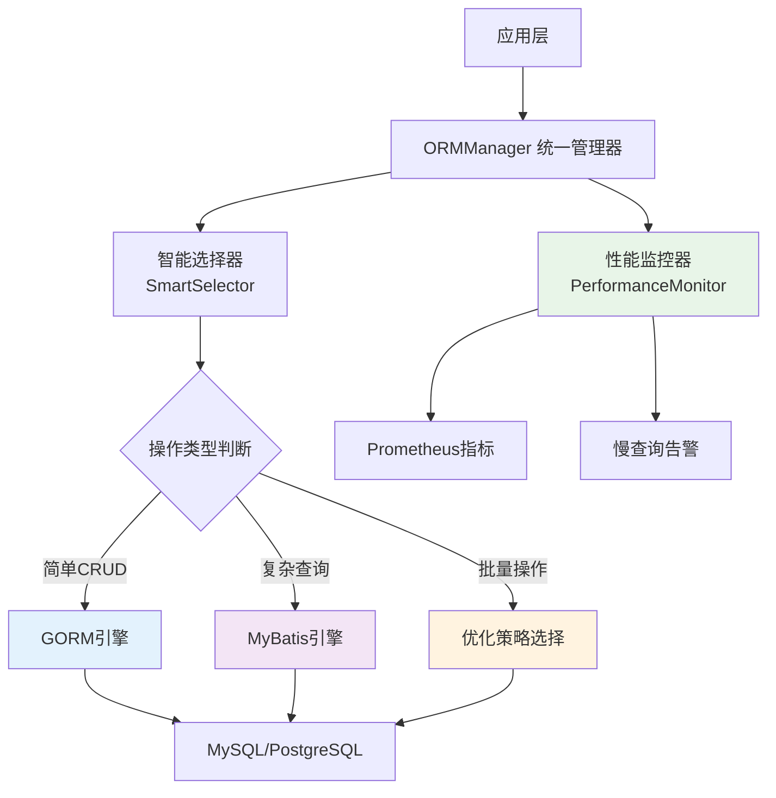

# 统一ORM解决方案

YYHertz框架的统一ORM解决方案，集成GORM和MyBatis双引擎，提供智能路由、性能监控和开发者友好的API设计。

## 🎯 架构设计

### 双引擎协同架构



### 核心组件

| 组件 | 功能 | 适用场景 |
|------|------|----------|
| **ORMManager** | 统一管理和协调 | 所有数据库操作的入口 |
| **SmartSelector** | 智能引擎选择 | 根据操作复杂度自动选择引擎 |
| **PerformanceMonitor** | 性能监控和优化 | 实时监控、慢查询检测 |
| **GORM引擎** | 高效简单操作 | CRUD、关联查询、事务 |
| **MyBatis引擎** | 复杂SQL处理 | 动态SQL、存储过程、复杂报表 |

## 🚀 快速开始

### 1. 基础配置

```yaml
# conf/orm.yaml
orm:
  # 引擎配置
  engines:
    gorm:
      enabled: true
      default_engine: true
    mybatis:
      enabled: true
      mapper_locations: "./mappers/*.xml"
  
  # 智能选择器配置
  smart_selector:
    enabled: true
    auto_fallback: true           # 自动降级
    complexity_threshold: 3       # 复杂度阈值
    
  # 性能监控配置  
  monitoring:
    enabled: true
    slow_query_threshold: "100ms" # 慢查询阈值
    metrics_enabled: true
    alert_enabled: true
    
  # 缓存配置
  cache:
    enabled: true
    type: "multi_level"           # 多级缓存
    l1_size: 1000                # L1缓存大小
    l2_redis: "localhost:6379"    # L2 Redis缓存
```

### 2. 初始化统一ORM

```go
package main

import (
    "github.com/zsy619/yyhertz/framework/orm"
    "github.com/zsy619/yyhertz/framework/config"
)

func main() {
    // 加载配置
    config := config.LoadORMConfig("conf/orm.yaml")
    
    // 创建统一ORM管理器
    ormManager, err := orm.NewManager(config)
    if err != nil {
        panic(err)
    }
    defer ormManager.Close()
    
    // 设置为全局默认实例
    orm.SetDefault(ormManager)
    
    // 启动性能监控
    ormManager.StartMonitoring()
    
    // 应用启动
    app := mvc.NewApp()
    app.Run()
}
```

### 3. 控制器集成

```go
// controllers/base_controller.go
package controllers

import (
    "github.com/zsy619/yyhertz/framework/mvc"
    "github.com/zsy619/yyhertz/framework/orm"
)

type BaseController struct {
    mvc.BaseController
}

// GetORM 获取统一ORM实例
func (c *BaseController) GetORM() *orm.Manager {
    return orm.GetDefault()
}

// WithTransaction 在事务中执行操作
func (c *BaseController) WithTransaction(fn func(orm *orm.Manager) error) error {
    return c.GetORM().Transaction(fn)
}

// QuickQuery 快速查询（自动选择引擎）
func (c *BaseController) QuickQuery(sql string, args ...interface{}) ([]map[string]interface{}, error) {
    return c.GetORM().Query(sql, args...)
}
```

## 🎨 智能引擎选择

### 自动选择策略

```go
package controllers

// 示例：用户控制器，展示智能引擎选择
type UserController struct {
    BaseController
}

// GetUsers 简单查询 -> 自动选择GORM引擎
func (c *UserController) GetUsers() {
    orm := c.GetORM()
    
    // 简单查询，智能选择器自动使用GORM
    users, err := orm.Find(&User{}).Where("status = ?", "active").All()
    if err != nil {
        c.Error(500, err.Error())
        return
    }
    
    c.JSON(mvc.Result{Success: true, Data: users})
}

// GetComplexReport 复杂查询 -> 自动选择MyBatis引擎
func (c *UserController) GetComplexReport() {
    orm := c.GetORM()
    
    // 复杂查询，智能选择器自动使用MyBatis
    report, err := orm.Query(`
        SELECT 
            u.department,
            COUNT(*) as user_count,
            AVG(CASE WHEN o.status = 'completed' THEN o.amount ELSE 0 END) as avg_amount,
            DATE_FORMAT(o.created_at, '%Y-%m') as month
        FROM users u
        LEFT JOIN orders o ON u.id = o.user_id
        WHERE u.created_at >= DATE_SUB(NOW(), INTERVAL 12 MONTH)
        GROUP BY u.department, DATE_FORMAT(o.created_at, '%Y-%m')
        HAVING user_count > 5
        ORDER BY month DESC, avg_amount DESC
    `)
    
    if err != nil {
        c.Error(500, err.Error())
        return
    }
    
    c.JSON(mvc.Result{Success: true, Data: report})
}

// BatchCreate 批量操作 -> 优化策略选择
func (c *UserController) PostBatchCreate() {
    var users []User
    if err := c.ShouldBindJSON(&users); err != nil {
        c.Error(400, err.Error())
        return
    }
    
    orm := c.GetORM()
    
    // 批量操作，智能选择器选择最优策略
    affected, err := orm.BatchInsert("users", users, &orm.BatchOptions{
        BatchSize:    1000,        // 批量大小
        PreferEngine: "gorm",      // 首选引擎
        Concurrent:   true,        // 并发执行
    })
    
    if err != nil {
        c.Error(500, err.Error())
        return
    }
    
    c.JSON(mvc.Result{
        Success: true,
        Data: map[string]interface{}{
            "affected": affected,
            "total":    len(users),
        },
    })
}
```

### 手动引擎选择

```go
// GetAdvancedReport 手动指定使用MyBatis引擎
func (c *UserController) GetAdvancedReport() {
    orm := c.GetORM()
    
    // 手动选择MyBatis引擎处理复杂XML映射
    session := orm.MyBatis().OpenSession()
    defer session.Close()
    
    report, err := session.SelectList(
        "UserMapper.getAdvancedReport",
        map[string]interface{}{
            "startDate": c.GetQuery("start_date"),
            "endDate":   c.GetQuery("end_date"),
            "department": c.GetQuery("department"),
        },
    )
    
    if err != nil {
        c.Error(500, err.Error())
        return
    }
    
    c.JSON(mvc.Result{Success: true, Data: report})
}

// GetSimpleUsers 手动指定使用GORM引擎
func (c *UserController) GetSimpleUsers() {
    orm := c.GetORM()
    
    // 手动选择GORM引擎进行高效CRUD
    db := orm.GORM()
    
    var users []User
    err := db.Where("status = ?", "active").
        Preload("Profile").
        Order("created_at DESC").
        Limit(20).
        Find(&users).Error
        
    if err != nil {
        c.Error(500, err.Error())
        return
    }
    
    c.JSON(mvc.Result{Success: true, Data: users})
}
```

## 📊 性能监控与优化

### 1. 实时性能监控

```go
// 性能监控数据获取
func (c *AdminController) GetORMMetrics() {
    orm := c.GetORM()
    
    metrics := orm.GetMetrics()
    
    c.JSON(mvc.Result{
        Success: true,
        Data: map[string]interface{}{
            "engine_usage": map[string]interface{}{
                "gorm_queries":    metrics.GormQueries,
                "mybatis_queries": metrics.MyBatisQueries,
                "auto_selections": metrics.AutoSelections,
            },
            "performance": map[string]interface{}{
                "avg_latency":     metrics.AvgLatency.Milliseconds(),
                "slow_queries":    metrics.SlowQueryCount,
                "error_rate":      metrics.ErrorRate,
                "cache_hit_rate":  metrics.CacheHitRate,
            },
            "connections": map[string]interface{}{
                "active_connections": metrics.ActiveConnections,
                "max_connections":    metrics.MaxConnections,
                "pool_usage":         metrics.PoolUsagePercent,
            },
        },
    })
}
```

### 2. 慢查询分析

```go
// 慢查询报告
func (c *AdminController) GetSlowQueries() {
    orm := c.GetORM()
    
    slowQueries := orm.GetSlowQueries(&orm.SlowQueryOptions{
        TimeRange: "24h",
        Limit:     50,
        MinDuration: 100 * time.Millisecond,
    })
    
    c.JSON(mvc.Result{
        Success: true,
        Data: map[string]interface{}{
            "slow_queries": slowQueries,
            "analysis": map[string]interface{}{
                "most_frequent": slowQueries[0].SQL,
                "avg_duration":  orm.CalculateAvgDuration(slowQueries),
                "optimization_suggestions": orm.GetOptimizationSuggestions(slowQueries),
            },
        },
    })
}
```

### 3. 自动优化建议

```go
// 获取优化建议
func (c *AdminController) GetOptimizationSuggestions() {
    orm := c.GetORM()
    
    suggestions := orm.AnalyzeAndSuggest(&orm.AnalysisOptions{
        AnalyzePeriod:    "7d",
        IncludeIndexing:  true,
        IncludeQueries:   true,
        IncludeSchema:    true,
    })
    
    c.JSON(mvc.Result{
        Success: true,
        Data: map[string]interface{}{
            "indexing_suggestions":    suggestions.IndexingSuggestions,
            "query_optimizations":     suggestions.QueryOptimizations,
            "schema_improvements":     suggestions.SchemaImprovements,
            "engine_recommendations": suggestions.EngineRecommendations,
        },
    })
}
```

## 🔧 高级特性

### 1. 跨引擎事务支持

```go
// 跨引擎事务示例
func (c *OrderController) PostCompleteOrder() {
    orm := c.GetORM()
    
    err := orm.CrossEngineTransaction(func(tx *orm.TransactionContext) error {
        // 使用GORM更新订单状态
        gormTx := tx.GORM()
        if err := gormTx.Model(&Order{}).Where("id = ?", orderID).
            Update("status", "completed").Error; err != nil {
            return err
        }
        
        // 使用MyBatis执行复杂的库存和财务计算
        mybatisTx := tx.MyBatis()
        _, err := mybatisTx.Update("OrderMapper.updateInventoryAndFinance", map[string]interface{}{
            "orderId":    orderID,
            "updateTime": time.Now(),
        })
        
        return err
    })
    
    if err != nil {
        c.Error(500, "订单处理失败: "+err.Error())
        return
    }
    
    c.JSON(mvc.Result{Success: true, Message: "订单处理成功"})
}
```

### 2. 智能缓存管理

```go
// 多级缓存示例
func (c *UserController) GetUserProfile() {
    userID := c.GetParam("id")
    orm := c.GetORM()
    
    // 智能缓存查询：L1(内存) -> L2(Redis) -> DB
    profile, err := orm.Cache().GetOrSet(
        fmt.Sprintf("user:profile:%s", userID),
        func() (interface{}, error) {
            // 缓存未命中，查询数据库
            return orm.Find(&UserProfile{}).Where("user_id = ?", userID).First()
        },
        &orm.CacheOptions{
            TTL:           5 * time.Minute,
            UseL1Cache:    true,
            UseL2Cache:    true,
            RefreshOnHit:  true,
        },
    )
    
    if err != nil {
        c.Error(500, err.Error())
        return
    }
    
    c.JSON(mvc.Result{Success: true, Data: profile})
}
```

### 3. 动态分片支持

```go
// 数据分片示例
func (c *OrderController) GetOrderHistory() {
    userID := c.GetParam("user_id")
    orm := c.GetORM()
    
    // 根据用户ID自动分片查询
    orders, err := orm.Shard().Query(&orm.ShardQuery{
        SQL: "SELECT * FROM orders WHERE user_id = ? ORDER BY created_at DESC LIMIT 20",
        Args: []interface{}{userID},
        ShardKey: userID,        // 分片键
        ShardType: "user_based", // 分片类型
    })
    
    if err != nil {
        c.Error(500, err.Error())
        return
    }
    
    c.JSON(mvc.Result{Success: true, Data: orders})
}
```

## 🎯 开发者工具

### 1. DryRun调试模式

```go
// 开发环境调试
func (c *UserController) DebugQuery() {
    orm := c.GetORM()
    
    // 启用DryRun模式，只生成SQL不执行
    result := orm.DryRun().Query(`
        SELECT u.*, p.phone, p.address 
        FROM users u 
        LEFT JOIN profiles p ON u.id = p.user_id 
        WHERE u.status = ?
    `, "active")
    
    c.JSON(mvc.Result{
        Success: true,
        Data: map[string]interface{}{
            "generated_sql": result.SQL,
            "parameters":    result.Parameters,
            "engine_used":   result.EngineUsed,
            "execution_plan": result.ExecutionPlan,
        },
    })
}
```

### 2. 性能分析工具

```go
// 性能分析
func (c *AdminController) GetPerformanceAnalysis() {
    orm := c.GetORM()
    
    analysis := orm.Analyze(&orm.AnalyzeOptions{
        SQL:         c.GetQuery("sql"),
        Parameters:  c.GetQueryArray("params"),
        Explain:     true,
        Benchmark:   true,
        Iterations:  100,
    })
    
    c.JSON(mvc.Result{
        Success: true,
        Data: map[string]interface{}{
            "execution_plan": analysis.ExecutionPlan,
            "benchmark_results": map[string]interface{}{
                "avg_duration":    analysis.AvgDuration,
                "min_duration":    analysis.MinDuration,
                "max_duration":    analysis.MaxDuration,
                "operations_per_second": analysis.OPS,
            },
            "optimization_suggestions": analysis.Suggestions,
        },
    })
}
```

## 🚨 告警与监控集成

### 1. Prometheus指标

```yaml
# prometheus.yml 配置示例
scrape_configs:
  - job_name: 'yyhertz-orm'
    static_configs:
      - targets: ['localhost:8080']
    metrics_path: '/metrics'
    scrape_interval: 15s
```

### 2. 告警规则

```yaml
# alert-rules.yml
groups:
  - name: yyhertz-orm
    rules:
      - alert: ORMHighErrorRate
        expr: orm_error_rate > 0.05
        for: 2m
        labels:
          severity: warning
        annotations:
          summary: "ORM错误率过高"
          description: "ORM错误率超过5%，当前值: {{ $value }}"
          
      - alert: ORMSlowQueries
        expr: increase(orm_slow_queries_total[5m]) > 10
        for: 1m
        labels:
          severity: critical
        annotations:
          summary: "慢查询激增"
          description: "5分钟内慢查询超过10个"
          
      - alert: ORMConnectionPoolHigh
        expr: orm_connection_pool_usage > 0.8
        for: 2m
        labels:
          severity: warning
        annotations:
          summary: "数据库连接池使用率过高"
          description: "连接池使用率超过80%"
```

## 📚 最佳实践

### 1. 引擎选择建议

| 场景 | 推荐引擎 | 原因 |
|------|----------|------|
| 简单CRUD操作 | GORM | 代码简洁，性能优异 |
| 复杂聚合查询 | MyBatis | SQL灵活性，可优化性强 |
| 批量数据处理 | GORM | 批处理优化，内存效率高 |
| 动态查询条件 | MyBatis | 动态SQL支持完善 |
| 关联查询(<=3层) | GORM | 预加载机制高效 |
| 关联查询(>3层) | MyBatis | 避免N+1问题，控制精确 |
| 事务操作 | 智能选择 | 根据复杂度自动选择 |
| 报表生成 | MyBatis | SQL可读性和可维护性强 |

### 2. 性能优化建议

```go
// 性能优化配置示例
func OptimizeORMPerformance() *orm.Config {
    return &orm.Config{
        // 连接池优化
        DB: &orm.DBConfig{
            MaxIdleConns:    50,
            MaxOpenConns:    200,
            ConnMaxLifetime: time.Hour,
            ConnMaxIdleTime: 30 * time.Minute,
        },
        
        // 缓存优化  
        Cache: &orm.CacheConfig{
            L1Size:           1000,
            L1TTL:           5 * time.Minute,
            L2TTL:           30 * time.Minute,
            CompressThreshold: 1024, // 1KB以上数据压缩
        },
        
        // 批处理优化
        Batch: &orm.BatchConfig{
            DefaultSize:     1000,
            MaxSize:        10000,
            MaxConcurrency: 10,
        },
        
        // 监控配置
        Monitoring: &orm.MonitoringConfig{
            SlowQueryThreshold:  100 * time.Millisecond,
            SampleRate:         0.1, // 10%采样
            RetentionDays:      7,
        },
    }
}
```

### 3. 错误处理模式

```go
// 统一错误处理
func (c *BaseController) HandleORMError(err error, operation string) {
    if err == nil {
        return
    }
    
    switch {
    case orm.IsRecordNotFound(err):
        c.Error(404, "记录不存在")
    case orm.IsConnectionError(err):
        c.Error(503, "数据库连接异常")
    case orm.IsTimeout(err):
        c.Error(408, "查询超时")
    case orm.IsValidationError(err):
        c.Error(400, "数据验证失败: "+err.Error())
    default:
        c.Logger.Error("数据库操作失败", "operation", operation, "error", err)
        c.Error(500, "操作失败")
    }
}
```

## 🔗 相关资源

- **[GORM集成](./gorm.md)** - 详细的GORM使用指南
- **[MyBatis基础](./mybatis-basic.md)** - MyBatis基础功能
- **[MyBatis高级特性](./mybatis-advanced.md)** - XML映射器和动态SQL
- **[MyBatis性能优化](./mybatis-performance.md)** - 性能调优最佳实践
- **[数据库调优](./database-tuning.md)** - 数据库层面优化
- **[缓存策略](./caching-strategies.md)** - 缓存设计模式
- **[监控告警](./monitoring-alerting.md)** - 完整监控方案

---

**统一ORM解决方案让您同时享受GORM的高效和MyBatis的灵活** - 智能选择，性能优先，开发者友好！🚀