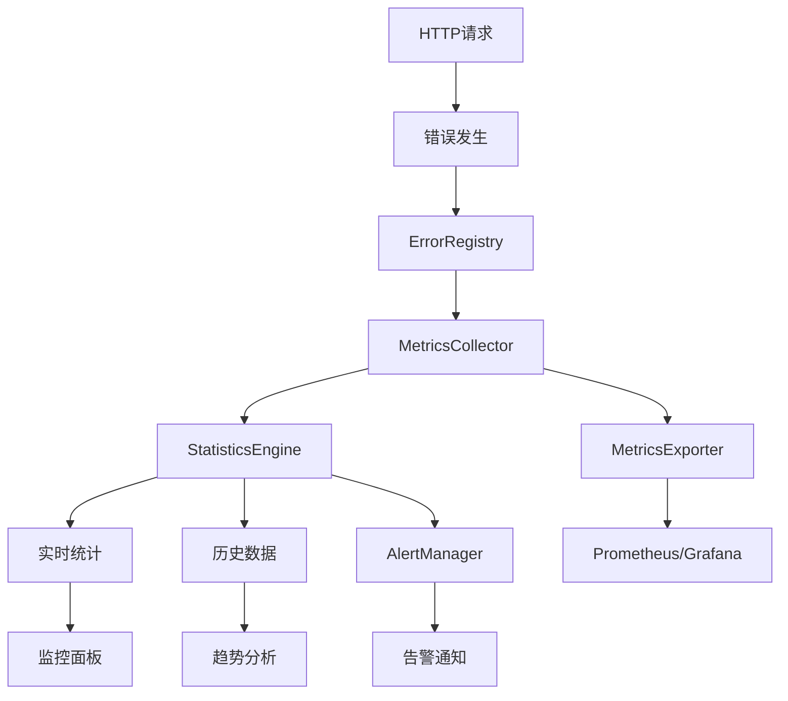

# 📊 YYHertz 错误监控和统计

本文档详细介绍如何建立完善的错误监控体系，包括错误统计、性能指标、告警机制和可视化面板。

## 🏗️ 监控系统架构

### 核心组件

YYHertz错误监控系统由以下组件构成：

```go
// 监控系统核心结构
type MonitoringSystem struct {
    ErrorRegistry     *ErrorRegistry      // 错误注册器
    MetricsCollector  *MetricsCollector   // 指标收集器
    AlertManager      *AlertManager       // 告警管理器
    StatisticsEngine  *StatisticsEngine   // 统计引擎
    Dashboard         *Dashboard          // 监控面板
    Exporter          *MetricsExporter    // 指标导出器
}

// ErrorStatistics 错误统计信息
type ErrorStatistics struct {
    TotalErrors      int64                    `json:"total_errors"`       // 总错误数
    ErrorsByStatus   map[int]int64            `json:"errors_by_status"`   // 按状态码统计
    ErrorsByPath     map[string]int64         `json:"errors_by_path"`     // 按路径统计
    ErrorsByTime     map[string]int64         `json:"errors_by_time"`     // 按时间统计
    LastErrors       []ErrorRecord            `json:"last_errors"`        // 最近错误记录
    StartTime        time.Time                `json:"start_time"`         // 统计开始时间
    mu               sync.RWMutex             `json:"-"`                  // 并发保护
}

// ErrorRecord 错误记录
type ErrorRecord struct {
    ID          string    `json:"id"`           // 错误ID
    StatusCode  int       `json:"status_code"`  // 状态码
    Path        string    `json:"path"`         // 请求路径
    Method      string    `json:"method"`       // 请求方法
    Message     string    `json:"message"`      // 错误信息
    UserAgent   string    `json:"user_agent"`   // 用户代理
    IP          string    `json:"ip"`           // 客户端IP
    Timestamp   time.Time `json:"timestamp"`    // 错误时间
    Duration    int64     `json:"duration"`     // 处理时间(毫秒)
    StackTrace  string    `json:"stack_trace"`  // 堆栈跟踪
}
```

### 监控数据流



## 📈 实时指标收集

### 1. MetricsCollector 实现

```go
// MetricsCollector 指标收集器
type MetricsCollector struct {
    registry     *ErrorRegistry
    statistics   *ErrorStatistics
    config       *MetricsConfig
    exporters    []MetricsExporter
    mu           sync.RWMutex
}

// MetricsConfig 指标配置
type MetricsConfig struct {
    Enabled           bool          `json:"enabled"`             // 是否启用指标
    SampleRate        float64       `json:"sample_rate"`         // 采样率
    MaxRecords        int           `json:"max_records"`         // 最大记录数
    RetentionPeriod   time.Duration `json:"retention_period"`    // 保留期
    ExportInterval    time.Duration `json:"export_interval"`     // 导出间隔
    EnableStackTrace  bool          `json:"enable_stack_trace"`  // 启用堆栈跟踪
    EnableGeoIP       bool          `json:"enable_geo_ip"`       // 启用地理位置
}

func NewMetricsCollector(registry *ErrorRegistry) *MetricsCollector {
    return &MetricsCollector{
        registry: registry,
        statistics: &ErrorStatistics{
            ErrorsByStatus: make(map[int]int64),
            ErrorsByPath:   make(map[string]int64),
            ErrorsByTime:   make(map[string]int64),
            LastErrors:     make([]ErrorRecord, 0),
            StartTime:      time.Now(),
        },
        config: &MetricsConfig{
            Enabled:         true,
            SampleRate:      1.0,
            MaxRecords:      1000,
            RetentionPeriod: 24 * time.Hour,
            ExportInterval:  time.Minute,
        },
        exporters: make([]MetricsExporter, 0),
    }
}

// CollectError 收集错误指标
func (c *MetricsCollector) CollectError(ctx *Context, statusCode int, err error, duration time.Duration) {
    if !c.config.Enabled {
        return
    }
    
    // 采样控制
    if rand.Float64() > c.config.SampleRate {
        return
    }
    
    c.mu.Lock()
    defer c.mu.Unlock()
    
    // 基础统计
    c.statistics.TotalErrors++
    c.statistics.ErrorsByStatus[statusCode]++
    
    path := string(ctx.Path())
    c.statistics.ErrorsByPath[path]++
    
    // 按小时统计
    timeKey := time.Now().Format("2006-01-02-15")
    c.statistics.ErrorsByTime[timeKey]++
    
    // 创建错误记录
    record := ErrorRecord{
        ID:         generateErrorID(),
        StatusCode: statusCode,
        Path:       path,
        Method:     string(ctx.Method()),
        Message:    err.Error(),
        UserAgent:  string(ctx.UserAgent()),
        IP:         ctx.ClientIP(),
        Timestamp:  time.Now(),
        Duration:   duration.Milliseconds(),
    }
    
    // 添加堆栈跟踪
    if c.config.EnableStackTrace {
        record.StackTrace = getStackTrace()
    }
    
    // 添加到最近错误列表
    c.addErrorRecord(record)
    
    // 清理过期数据
    c.cleanupOldRecords()
    
    // 异步导出指标
    go c.exportMetrics(record)
}

// addErrorRecord 添加错误记录
func (c *MetricsCollector) addErrorRecord(record ErrorRecord) {
    c.statistics.LastErrors = append(c.statistics.LastErrors, record)
    
    // 保持最大记录数限制
    if len(c.statistics.LastErrors) > c.config.MaxRecords {
        c.statistics.LastErrors = c.statistics.LastErrors[1:]
    }
}

// cleanupOldRecords 清理过期记录
func (c *MetricsCollector) cleanupOldRecords() {
    cutoff := time.Now().Add(-c.config.RetentionPeriod)
    
    // 清理过期的错误记录
    validRecords := make([]ErrorRecord, 0)
    for _, record := range c.statistics.LastErrors {
        if record.Timestamp.After(cutoff) {
            validRecords = append(validRecords, record)
        }
    }
    c.statistics.LastErrors = validRecords
    
    // 清理过期的时间统计
    for timeKey := range c.statistics.ErrorsByTime {
        if timeStr, err := time.Parse("2006-01-02-15", timeKey); err == nil {
            if timeStr.Before(cutoff) {
                delete(c.statistics.ErrorsByTime, timeKey)
            }
        }
    }
}

// exportMetrics 导出指标
func (c *MetricsCollector) exportMetrics(record ErrorRecord) {
    for _, exporter := range c.exporters {
        if err := exporter.Export(record); err != nil {
            log.Printf("Failed to export metrics: %v", err)
        }
    }
}

// GetStatistics 获取统计信息
func (c *MetricsCollector) GetStatistics() *ErrorStatistics {
    c.mu.RLock()
    defer c.mu.RUnlock()
    
    // 深拷贝统计数据
    stats := &ErrorStatistics{
        TotalErrors:    c.statistics.TotalErrors,
        ErrorsByStatus: make(map[int]int64),
        ErrorsByPath:   make(map[string]int64),
        ErrorsByTime:   make(map[string]int64),
        LastErrors:     make([]ErrorRecord, len(c.statistics.LastErrors)),
        StartTime:      c.statistics.StartTime,
    }
    
    for k, v := range c.statistics.ErrorsByStatus {
        stats.ErrorsByStatus[k] = v
    }
    for k, v := range c.statistics.ErrorsByPath {
        stats.ErrorsByPath[k] = v
    }
    for k, v := range c.statistics.ErrorsByTime {
        stats.ErrorsByTime[k] = v
    }
    copy(stats.LastErrors, c.statistics.LastErrors)
    
    return stats
}
```

### 2. 实时统计API

```go
// MonitoringController 监控控制器
type MonitoringController struct {
    collector *MetricsCollector
    registry  *ErrorRegistry
}

func NewMonitoringController(collector *MetricsCollector, registry *ErrorRegistry) *MonitoringController {
    return &MonitoringController{
        collector: collector,
        registry:  registry,
    }
}

// GetStatistics 获取实时统计
func (c *MonitoringController) GetStatistics(ctx *Context) {
    stats := c.collector.GetStatistics()
    
    // 计算衍生指标
    uptime := time.Since(stats.StartTime)
    errorRate := float64(stats.TotalErrors) / uptime.Hours()
    
    // 计算错误分布
    distribution := c.calculateErrorDistribution(stats)
    
    // 计算趋势
    trends := c.calculateTrends(stats)
    
    response := map[string]any{
        "summary": map[string]any{
            "total_errors":        stats.TotalErrors,
            "error_rate_per_hour": errorRate,
            "uptime_hours":        uptime.Hours(),
            "start_time":          stats.StartTime,
        },
        "distribution": distribution,
        "trends":       trends,
        "recent_errors": c.getRecentErrors(stats, time.Hour),
        "top_paths":     c.getTopErrorPaths(stats, 10),
        "health_status": c.getHealthStatus(stats),
    }
    
    ctx.JSON(200, response)
}

// GetMetrics 获取Prometheus格式指标
func (c *MonitoringController) GetMetrics(ctx *Context) {
    stats := c.collector.GetStatistics()
    
    // 生成Prometheus格式的指标
    metrics := []string{
        "# HELP errors_total Total number of errors",
        "# TYPE errors_total counter",
        fmt.Sprintf("errors_total %d", stats.TotalErrors),
        "",
    }
    
    // 按状态码分组的指标
    metrics = append(metrics, "# HELP errors_by_status_total Errors by HTTP status code")
    metrics = append(metrics, "# TYPE errors_by_status_total counter")
    
    for status, count := range stats.ErrorsByStatus {
        metrics = append(metrics, 
            fmt.Sprintf("errors_by_status_total{status_code=\"%d\"} %d", status, count))
    }
    
    metrics = append(metrics, "")
    
    // 按路径分组的指标（仅显示前20个）
    topPaths := c.getTopErrorPaths(stats, 20)
    metrics = append(metrics, "# HELP errors_by_path_total Errors by request path")
    metrics = append(metrics, "# TYPE errors_by_path_total counter")
    
    for _, pathInfo := range topPaths {
        metrics = append(metrics,
            fmt.Sprintf("errors_by_path_total{path=\"%s\"} %d", 
                pathInfo.Path, pathInfo.Count))
    }
    
    // 设置Content-Type
    ctx.Header("Content-Type", "text/plain; charset=utf-8")
    ctx.String(200, strings.Join(metrics, "\n"))
}

// GetHealthStatus 获取健康状态
func (c *MonitoringController) GetHealthStatus(ctx *Context) {
    stats := c.collector.GetStatistics()
    health := c.getHealthStatus(stats)
    
    statusCode := 200
    if health.Status == "degraded" {
        statusCode = 206
    } else if health.Status == "unhealthy" {
        statusCode = 503
    }
    
    ctx.JSON(statusCode, health)
}

// 辅助方法
func (c *MonitoringController) calculateErrorDistribution(stats *ErrorStatistics) map[string]any {
    clientErrors := int64(0)  // 4xx
    serverErrors := int64(0)  // 5xx
    otherErrors := int64(0)   // 其他
    
    for status, count := range stats.ErrorsByStatus {
        switch {
        case status >= 400 && status < 500:
            clientErrors += count
        case status >= 500 && status < 600:
            serverErrors += count
        default:
            otherErrors += count
        }
    }
    
    total := float64(stats.TotalErrors)
    if total == 0 {
        total = 1 // 防止除零
    }
    
    return map[string]any{
        "client_errors": map[string]any{
            "count":      clientErrors,
            "percentage": float64(clientErrors) / total * 100,
        },
        "server_errors": map[string]any{
            "count":      serverErrors,
            "percentage": float64(serverErrors) / total * 100,
        },
        "other_errors": map[string]any{
            "count":      otherErrors,
            "percentage": float64(otherErrors) / total * 100,
        },
        "by_status": stats.ErrorsByStatus,
    }
}

func (c *MonitoringController) calculateTrends(stats *ErrorStatistics) map[string]any {
    now := time.Now()
    
    // 计算最近24小时的趋势
    hourlyData := make(map[int]int64)
    for _, record := range stats.LastErrors {
        hoursAgo := int(now.Sub(record.Timestamp).Hours())
        if hoursAgo < 24 {
            hourlyData[hoursAgo]++
        }
    }
    
    // 计算趋势方向
    recentCount := int64(0)  // 最近6小时
    olderCount := int64(0)   // 6-12小时前
    
    for hour, count := range hourlyData {
        if hour < 6 {
            recentCount += count
        } else if hour >= 6 && hour < 12 {
            olderCount += count
        }
    }
    
    trend := "stable"
    if recentCount > olderCount*2 {
        trend = "increasing"
    } else if olderCount > recentCount*2 {
        trend = "decreasing"
    }
    
    return map[string]any{
        "direction":          trend,
        "recent_6h":          recentCount,
        "previous_6h":        olderCount,
        "hourly_distribution": hourlyData,
    }
}

func (c *MonitoringController) getRecentErrors(stats *ErrorStatistics, duration time.Duration) []ErrorRecord {
    cutoff := time.Now().Add(-duration)
    recent := make([]ErrorRecord, 0)
    
    for _, record := range stats.LastErrors {
        if record.Timestamp.After(cutoff) {
            recent = append(recent, record)
        }
    }
    
    return recent
}

func (c *MonitoringController) getTopErrorPaths(stats *ErrorStatistics, limit int) []PathErrorInfo {
    type PathErrorInfo struct {
        Path  string `json:"path"`
        Count int64  `json:"count"`
    }
    
    paths := make([]PathErrorInfo, 0)
    for path, count := range stats.ErrorsByPath {
        paths = append(paths, PathErrorInfo{Path: path, Count: count})
    }
    
    // 排序
    sort.Slice(paths, func(i, j int) bool {
        return paths[i].Count > paths[j].Count
    })
    
    // 限制数量
    if len(paths) > limit {
        paths = paths[:limit]
    }
    
    return paths
}

func (c *MonitoringController) getHealthStatus(stats *ErrorStatistics) map[string]any {
    status := "healthy"
    issues := make([]string, 0)
    
    // 检查错误率
    uptime := time.Since(stats.StartTime)
    errorRate := float64(stats.TotalErrors) / uptime.Hours()
    
    if errorRate > 100 {
        status = "degraded"
        issues = append(issues, "高错误率")
    }
    
    if errorRate > 500 {
        status = "unhealthy"
        issues = append(issues, "极高错误率")
    }
    
    // 检查服务器错误比例
    serverErrors := int64(0)
    for statusCode, count := range stats.ErrorsByStatus {
        if statusCode >= 500 {
            serverErrors += count
        }
    }
    
    if stats.TotalErrors > 0 {
        serverErrorRate := float64(serverErrors) / float64(stats.TotalErrors)
        if serverErrorRate > 0.5 {
            status = "unhealthy"
            issues = append(issues, "服务器错误过多")
        } else if serverErrorRate > 0.2 {
            if status != "unhealthy" {
                status = "degraded"
            }
            issues = append(issues, "服务器错误较多")
        }
    }
    
    // 检查最近错误趋势
    recentErrors := c.getRecentErrors(stats, time.Hour)
    if len(recentErrors) > 50 {
        if status == "healthy" {
            status = "degraded"
        }
        issues = append(issues, "最近错误频繁")
    }
    
    result := map[string]any{
        "status":    status,
        "timestamp": time.Now(),
        "metrics": map[string]any{
            "total_errors":        stats.TotalErrors,
            "error_rate_per_hour": errorRate,
            "server_error_rate":   float64(serverErrors) / float64(stats.TotalErrors),
            "recent_hour_errors":  len(recentErrors),
        },
    }
    
    if len(issues) > 0 {
        result["issues"] = issues
    }
    
    return result
}
```

## 🚨 告警系统

### 1. AlertManager 实现

```go
// AlertManager 告警管理器
type AlertManager struct {
    rules       []AlertRule
    notifiers   []Notifier
    config      *AlertConfig
    silences    map[string]time.Time  // 静默规则
    mu          sync.RWMutex
}

// AlertRule 告警规则
type AlertRule struct {
    Name        string                `json:"name"`         // 规则名称
    Condition   AlertCondition        `json:"condition"`    // 告警条件
    Severity    AlertSeverity         `json:"severity"`     // 严重级别
    Interval    time.Duration         `json:"interval"`     // 检查间隔
    Threshold   float64               `json:"threshold"`    // 阈值
    Duration    time.Duration         `json:"duration"`     // 持续时间
    Enabled     bool                  `json:"enabled"`      // 是否启用
    LastCheck   time.Time             `json:"last_check"`   // 最后检查时间
    LastAlert   time.Time             `json:"last_alert"`   // 最后告警时间
    Annotations map[string]string     `json:"annotations"`  // 注释信息
}

// AlertCondition 告警条件
type AlertCondition func(stats *ErrorStatistics) (bool, string)

// AlertSeverity 告警严重级别
type AlertSeverity string

const (
    AlertSeverityInfo     AlertSeverity = "info"     // 信息
    AlertSeverityWarning  AlertSeverity = "warning"  // 警告
    AlertSeverityError    AlertSeverity = "error"    // 错误
    AlertSeverityCritical AlertSeverity = "critical" // 严重
)

// Alert 告警信息
type Alert struct {
    Rule        AlertRule     `json:"rule"`         // 触发的规则
    Message     string        `json:"message"`      // 告警消息
    Severity    AlertSeverity `json:"severity"`     // 严重级别
    Timestamp   time.Time     `json:"timestamp"`    // 告警时间
    Labels      map[string]string `json:"labels"`   // 标签
    Annotations map[string]string `json:"annotations"` // 注释
}

func NewAlertManager(config *AlertConfig) *AlertManager {
    am := &AlertManager{
        rules:     make([]AlertRule, 0),
        notifiers: make([]Notifier, 0),
        config:    config,
        silences:  make(map[string]time.Time),
    }
    
    // 添加默认告警规则
    am.addDefaultRules()
    
    return am
}

// addDefaultRules 添加默认告警规则
func (am *AlertManager) addDefaultRules() {
    // 高错误率告警
    am.AddRule(AlertRule{
        Name:      "high_error_rate",
        Condition: am.highErrorRateCondition,
        Severity:  AlertSeverityWarning,
        Interval:  time.Minute,
        Threshold: 10.0, // 每小时10个错误
        Duration:  5 * time.Minute,
        Enabled:   true,
        Annotations: map[string]string{
            "description": "错误率异常升高",
            "runbook":     "检查服务状态和最近的部署",
        },
    })
    
    // 服务器错误告警
    am.AddRule(AlertRule{
        Name:      "server_errors",
        Condition: am.serverErrorsCondition,
        Severity:  AlertSeverityError,
        Interval:  time.Minute,
        Threshold: 0.1, // 10%的服务器错误率
        Duration:  2 * time.Minute,
        Enabled:   true,
        Annotations: map[string]string{
            "description": "服务器错误率过高",
            "runbook":     "检查服务器日志和系统资源",
        },
    })
    
    // 大量404错误告警
    am.AddRule(AlertRule{
        Name:      "many_404_errors",
        Condition: am.many404ErrorsCondition,
        Severity:  AlertSeverityInfo,
        Interval:  5 * time.Minute,
        Threshold: 50, // 5分钟内50个404错误
        Duration:  5 * time.Minute,
        Enabled:   true,
        Annotations: map[string]string{
            "description": "大量404错误，可能有爬虫或恶意访问",
            "runbook":     "检查访问日志和防护策略",
        },
    })
}

// AddRule 添加告警规则
func (am *AlertManager) AddRule(rule AlertRule) {
    am.mu.Lock()
    defer am.mu.Unlock()
    
    am.rules = append(am.rules, rule)
}

// AddNotifier 添加通知器
func (am *AlertManager) AddNotifier(notifier Notifier) {
    am.mu.Lock()
    defer am.mu.Unlock()
    
    am.notifiers = append(am.notifiers, notifier)
}

// Check 检查告警条件
func (am *AlertManager) Check(stats *ErrorStatistics) {
    am.mu.RLock()
    rules := make([]AlertRule, len(am.rules))
    copy(rules, am.rules)
    am.mu.RUnlock()
    
    for i, rule := range rules {
        if !rule.Enabled {
            continue
        }
        
        // 检查间隔
        if time.Since(rule.LastCheck) < rule.Interval {
            continue
        }
        
        // 更新检查时间
        am.mu.Lock()
        am.rules[i].LastCheck = time.Now()
        am.mu.Unlock()
        
        // 执行条件检查
        triggered, message := rule.Condition(stats)
        if triggered {
            // 检查是否在静默期
            if am.isSilenced(rule.Name) {
                continue
            }
            
            // 检查持续时间要求
            if time.Since(rule.LastAlert) < rule.Duration {
                continue
            }
            
            // 发送告警
            alert := Alert{
                Rule:        rule,
                Message:     message,
                Severity:    rule.Severity,
                Timestamp:   time.Now(),
                Labels: map[string]string{
                    "rule_name": rule.Name,
                    "severity":  string(rule.Severity),
                },
                Annotations: rule.Annotations,
            }
            
            am.sendAlert(alert)
            
            // 更新最后告警时间
            am.mu.Lock()
            am.rules[i].LastAlert = time.Now()
            am.mu.Unlock()
        }
    }
}

// 告警条件实现
func (am *AlertManager) highErrorRateCondition(stats *ErrorStatistics) (bool, string) {
    uptime := time.Since(stats.StartTime)
    errorRate := float64(stats.TotalErrors) / uptime.Hours()
    
    if errorRate > am.getRuleThreshold("high_error_rate") {
        return true, fmt.Sprintf("错误率 %.2f/小时 超过阈值", errorRate)
    }
    return false, ""
}

func (am *AlertManager) serverErrorsCondition(stats *ErrorStatistics) (bool, string) {
    if stats.TotalErrors == 0 {
        return false, ""
    }
    
    serverErrors := int64(0)
    for status, count := range stats.ErrorsByStatus {
        if status >= 500 {
            serverErrors += count
        }
    }
    
    rate := float64(serverErrors) / float64(stats.TotalErrors)
    threshold := am.getRuleThreshold("server_errors")
    
    if rate > threshold {
        return true, fmt.Sprintf("服务器错误率 %.2f%% 超过阈值 %.2f%%", 
            rate*100, threshold*100)
    }
    return false, ""
}

func (am *AlertManager) many404ErrorsCondition(stats *ErrorStatistics) (bool, string) {
    recent404 := int64(0)
    cutoff := time.Now().Add(-5 * time.Minute)
    
    for _, record := range stats.LastErrors {
        if record.StatusCode == 404 && record.Timestamp.After(cutoff) {
            recent404++
        }
    }
    
    threshold := int64(am.getRuleThreshold("many_404_errors"))
    
    if recent404 > threshold {
        return true, fmt.Sprintf("最近5分钟内有 %d 个404错误", recent404)
    }
    return false, ""
}

// sendAlert 发送告警
func (am *AlertManager) sendAlert(alert Alert) {
    for _, notifier := range am.notifiers {
        go func(n Notifier) {
            if err := n.Notify(alert); err != nil {
                log.Printf("Failed to send alert via %T: %v", n, err)
            }
        }(notifier)
    }
}

// Silence 静默告警规则
func (am *AlertManager) Silence(ruleName string, duration time.Duration) {
    am.mu.Lock()
    defer am.mu.Unlock()
    
    am.silences[ruleName] = time.Now().Add(duration)
}

// isSilenced 检查是否被静默
func (am *AlertManager) isSilenced(ruleName string) bool {
    am.mu.RLock()
    defer am.mu.RUnlock()
    
    if silenceUntil, exists := am.silences[ruleName]; exists {
        return time.Now().Before(silenceUntil)
    }
    return false
}

func (am *AlertManager) getRuleThreshold(ruleName string) float64 {
    for _, rule := range am.rules {
        if rule.Name == ruleName {
            return rule.Threshold
        }
    }
    return 0
}
```

### 2. 通知系统

```go
// Notifier 通知器接口
type Notifier interface {
    Notify(alert Alert) error
}

// EmailNotifier 邮件通知器
type EmailNotifier struct {
    SMTPHost     string
    SMTPPort     int
    Username     string
    Password     string
    From         string
    To           []string
    Subject      string
}

func (n *EmailNotifier) Notify(alert Alert) error {
    subject := fmt.Sprintf("[%s] %s", strings.ToUpper(string(alert.Severity)), alert.Rule.Name)
    body := n.formatEmailBody(alert)
    
    // 发送邮件逻辑
    return n.sendEmail(subject, body)
}

func (n *EmailNotifier) formatEmailBody(alert Alert) string {
    return fmt.Sprintf(`
告警规则: %s
严重级别: %s
触发时间: %s
告警消息: %s

详细信息:
%s

处理建议:
%s
`, 
        alert.Rule.Name,
        alert.Severity,
        alert.Timestamp.Format("2006-01-02 15:04:05"),
        alert.Message,
        n.formatDetails(alert),
        alert.Annotations["runbook"],
    )
}

func (n *EmailNotifier) formatDetails(alert Alert) string {
    details := make([]string, 0)
    for k, v := range alert.Labels {
        details = append(details, fmt.Sprintf("  %s: %s", k, v))
    }
    for k, v := range alert.Annotations {
        if k != "runbook" {
            details = append(details, fmt.Sprintf("  %s: %s", k, v))
        }
    }
    return strings.Join(details, "\n")
}

func (n *EmailNotifier) sendEmail(subject, body string) error {
    // 实现SMTP邮件发送
    // 这里简化实现，实际应该使用专业的邮件库
    log.Printf("Sending email: %s\n%s", subject, body)
    return nil
}

// WebhookNotifier Webhook通知器
type WebhookNotifier struct {
    URL     string
    Method  string
    Headers map[string]string
    Client  *http.Client
}

func (n *WebhookNotifier) Notify(alert Alert) error {
    payload, err := json.Marshal(alert)
    if err != nil {
        return err
    }
    
    req, err := http.NewRequest(n.Method, n.URL, bytes.NewBuffer(payload))
    if err != nil {
        return err
    }
    
    req.Header.Set("Content-Type", "application/json")
    for k, v := range n.Headers {
        req.Header.Set(k, v)
    }
    
    resp, err := n.Client.Do(req)
    if err != nil {
        return err
    }
    defer resp.Body.Close()
    
    if resp.StatusCode >= 400 {
        return fmt.Errorf("webhook returned status %d", resp.StatusCode)
    }
    
    return nil
}

// SlackNotifier Slack通知器
type SlackNotifier struct {
    WebhookURL string
    Channel    string
    Username   string
    IconEmoji  string
}

func (n *SlackNotifier) Notify(alert Alert) error {
    color := n.getColor(alert.Severity)
    
    payload := map[string]any{
        "channel":  n.Channel,
        "username": n.Username,
        "icon_emoji": n.IconEmoji,
        "attachments": []map[string]any{
            {
                "color": color,
                "title": fmt.Sprintf("告警: %s", alert.Rule.Name),
                "text":  alert.Message,
                "fields": []map[string]any{
                    {"title": "严重级别", "value": alert.Severity, "short": true},
                    {"title": "触发时间", "value": alert.Timestamp.Format("15:04:05"), "short": true},
                },
                "footer": "YYHertz 错误监控",
                "ts": alert.Timestamp.Unix(),
            },
        },
    }
    
    data, err := json.Marshal(payload)
    if err != nil {
        return err
    }
    
    resp, err := http.Post(n.WebhookURL, "application/json", bytes.NewBuffer(data))
    if err != nil {
        return err
    }
    defer resp.Body.Close()
    
    if resp.StatusCode != 200 {
        return fmt.Errorf("slack webhook returned status %d", resp.StatusCode)
    }
    
    return nil
}

func (n *SlackNotifier) getColor(severity AlertSeverity) string {
    switch severity {
    case AlertSeverityInfo:
        return "good"
    case AlertSeverityWarning:
        return "warning"
    case AlertSeverityError:
        return "danger"
    case AlertSeverityCritical:
        return "#ff0000"
    default:
        return "#808080"
    }
}
```

## 📊 可视化面板

### 1. 监控面板API

```go
// DashboardController 监控面板控制器
type DashboardController struct {
    collector *MetricsCollector
    registry  *ErrorRegistry
}

// GetDashboardData 获取面板数据
func (c *DashboardController) GetDashboardData(ctx *Context) {
    stats := c.collector.GetStatistics()
    
    // 计算时间范围
    timeRange := ctx.Query("range")
    if timeRange == "" {
        timeRange = "24h"
    }
    
    duration, err := time.ParseDuration(timeRange)
    if err != nil {
        duration = 24 * time.Hour
    }
    
    // 生成面板数据
    dashboard := map[string]any{
        "overview":    c.getOverview(stats),
        "timeseries":  c.getTimeseries(stats, duration),
        "top_errors":  c.getTopErrors(stats),
        "heatmap":     c.getErrorHeatmap(stats),
        "geographic":  c.getGeographicData(stats),
        "updated_at":  time.Now(),
    }
    
    ctx.JSON(200, dashboard)
}

// getOverview 获取概览数据
func (c *DashboardController) getOverview(stats *ErrorStatistics) map[string]any {
    uptime := time.Since(stats.StartTime)
    
    // 计算各种指标
    clientErrors := int64(0)
    serverErrors := int64(0)
    
    for status, count := range stats.ErrorsByStatus {
        if status >= 400 && status < 500 {
            clientErrors += count
        } else if status >= 500 {
            serverErrors += count
        }
    }
    
    // 计算最近趋势
    recentHour := c.getRecentErrors(stats, time.Hour)
    previousHour := c.getErrorsInTimeRange(stats, time.Hour*2, time.Hour)
    
    trend := "stable"
    if len(recentHour) > len(previousHour)*2 {
        trend = "increasing"
    } else if len(previousHour) > len(recentHour)*2 {
        trend = "decreasing"
    }
    
    return map[string]any{
        "total_errors":     stats.TotalErrors,
        "client_errors":    clientErrors,
        "server_errors":    serverErrors,
        "error_rate":       float64(stats.TotalErrors) / uptime.Hours(),
        "uptime_hours":     uptime.Hours(),
        "trend":           trend,
        "recent_hour_count": len(recentHour),
        "health_score":     c.calculateHealthScore(stats),
    }
}

// getTimeseries 获取时间序列数据
func (c *DashboardController) getTimeseries(stats *ErrorStatistics, duration time.Duration) map[string]any {
    now := time.Now()
    cutoff := now.Add(-duration)
    
    // 按小时分组
    hourlyData := make(map[string]map[int]int64)
    
    for _, record := range stats.LastErrors {
        if record.Timestamp.Before(cutoff) {
            continue
        }
        
        hourKey := record.Timestamp.Format("2006-01-02 15")
        if hourlyData[hourKey] == nil {
            hourlyData[hourKey] = make(map[int]int64)
        }
        hourlyData[hourKey][record.StatusCode]++
    }
    
    // 转换为图表数据
    timestamps := make([]string, 0)
    errorCounts := make([]int64, 0)
    clientErrorCounts := make([]int64, 0)
    serverErrorCounts := make([]int64, 0)
    
    // 生成完整时间序列
    current := cutoff.Truncate(time.Hour)
    for current.Before(now) {
        hourKey := current.Format("2006-01-02 15")
        timestamps = append(timestamps, current.Format("15:04"))
        
        total := int64(0)
        client := int64(0)
        server := int64(0)
        
        if data, exists := hourlyData[hourKey]; exists {
            for status, count := range data {
                total += count
                if status >= 400 && status < 500 {
                    client += count
                } else if status >= 500 {
                    server += count
                }
            }
        }
        
        errorCounts = append(errorCounts, total)
        clientErrorCounts = append(clientErrorCounts, client)
        serverErrorCounts = append(serverErrorCounts, server)
        
        current = current.Add(time.Hour)
    }
    
    return map[string]any{
        "timestamps":        timestamps,
        "total_errors":      errorCounts,
        "client_errors":     clientErrorCounts,
        "server_errors":     serverErrorCounts,
        "resolution":        "1h",
        "time_range":        duration.String(),
    }
}

// getTopErrors 获取Top错误
func (c *DashboardController) getTopErrors(stats *ErrorStatistics) map[string]any {
    // Top错误路径
    topPaths := make([]map[string]any, 0)
    for path, count := range stats.ErrorsByPath {
        topPaths = append(topPaths, map[string]any{
            "path":  path,
            "count": count,
        })
    }
    
    sort.Slice(topPaths, func(i, j int) bool {
        return topPaths[i]["count"].(int64) > topPaths[j]["count"].(int64)
    })
    
    if len(topPaths) > 10 {
        topPaths = topPaths[:10]
    }
    
    // Top状态码
    topStatus := make([]map[string]any, 0)
    for status, count := range stats.ErrorsByStatus {
        topStatus = append(topStatus, map[string]any{
            "status": status,
            "count":  count,
            "name":   http.StatusText(status),
        })
    }
    
    sort.Slice(topStatus, func(i, j int) bool {
        return topStatus[i]["count"].(int64) > topStatus[j]["count"].(int64)
    })
    
    return map[string]any{
        "paths":  topPaths,
        "status": topStatus,
    }
}

// getErrorHeatmap 获取错误热力图数据
func (c *DashboardController) getErrorHeatmap(stats *ErrorStatistics) map[string]any {
    // 按小时和星期几统计
    heatmapData := make(map[int]map[int]int64) // [weekday][hour] = count
    
    for _, record := range stats.LastErrors {
        weekday := int(record.Timestamp.Weekday())
        hour := record.Timestamp.Hour()
        
        if heatmapData[weekday] == nil {
            heatmapData[weekday] = make(map[int]int64)
        }
        heatmapData[weekday][hour]++
    }
    
    // 转换为数组格式
    data := make([][]int64, 7)
    for weekday := 0; weekday < 7; weekday++ {
        data[weekday] = make([]int64, 24)
        for hour := 0; hour < 24; hour++ {
            if heatmapData[weekday] != nil {
                data[weekday][hour] = heatmapData[weekday][hour]
            }
        }
    }
    
    return map[string]any{
        "data": data,
        "labels": map[string][]string{
            "weekdays": []string{"周日", "周一", "周二", "周三", "周四", "周五", "周六"},
            "hours":    generateHourLabels(),
        },
    }
}

func generateHourLabels() []string {
    labels := make([]string, 24)
    for i := 0; i < 24; i++ {
        labels[i] = fmt.Sprintf("%02d:00", i)
    }
    return labels
}

// calculateHealthScore 计算健康分数
func (c *DashboardController) calculateHealthScore(stats *ErrorStatistics) float64 {
    if stats.TotalErrors == 0 {
        return 100.0
    }
    
    score := 100.0
    
    // 基于错误率扣分
    uptime := time.Since(stats.StartTime)
    errorRate := float64(stats.TotalErrors) / uptime.Hours()
    
    if errorRate > 1 {
        score -= math.Min(errorRate*2, 50) // 最多扣50分
    }
    
    // 基于服务器错误比例扣分
    serverErrors := int64(0)
    for status, count := range stats.ErrorsByStatus {
        if status >= 500 {
            serverErrors += count
        }
    }
    
    serverErrorRate := float64(serverErrors) / float64(stats.TotalErrors)
    if serverErrorRate > 0.1 {
        score -= serverErrorRate * 30 // 最多扣30分
    }
    
    // 基于最近趋势调整
    recentErrors := c.getRecentErrors(stats, time.Hour)
    if len(recentErrors) > 10 {
        score -= 10
    }
    
    if score < 0 {
        score = 0
    }
    
    return score
}
```

### 2. 前端监控面板

```html
<!DOCTYPE html>
<html lang="zh-CN">
<head>
    <meta charset="UTF-8">
    <meta name="viewport" content="width=device-width, initial-scale=1.0">
    <title>YYHertz 错误监控面板</title>
    <script src="https://cdn.jsdelivr.net/npm/chart.js"></script>
    <script src="https://cdn.jsdelivr.net/npm/axios/dist/axios.min.js"></script>
    <style>
        body {
            font-family: 'Inter', sans-serif;
            background: #f5f7fa;
            margin: 0;
            padding: 20px;
        }
        
        .dashboard {
            max-width: 1400px;
            margin: 0 auto;
        }
        
        .dashboard-header {
            background: white;
            padding: 30px;
            border-radius: 12px;
            box-shadow: 0 2px 10px rgba(0,0,0,0.1);
            margin-bottom: 30px;
        }
        
        .metrics-grid {
            display: grid;
            grid-template-columns: repeat(auto-fit, minmax(250px, 1fr));
            gap: 20px;
            margin-bottom: 30px;
        }
        
        .metric-card {
            background: white;
            padding: 25px;
            border-radius: 12px;
            box-shadow: 0 2px 10px rgba(0,0,0,0.1);
            text-align: center;
        }
        
        .metric-value {
            font-size: 2.5rem;
            font-weight: 700;
            margin: 10px 0;
        }
        
        .metric-label {
            color: #666;
            font-size: 0.9rem;
            text-transform: uppercase;
            letter-spacing: 1px;
        }
        
        .charts-grid {
            display: grid;
            grid-template-columns: 2fr 1fr;
            gap: 30px;
            margin-bottom: 30px;
        }
        
        .chart-container {
            background: white;
            padding: 30px;
            border-radius: 12px;
            box-shadow: 0 2px 10px rgba(0,0,0,0.1);
        }
        
        .chart-title {
            font-size: 1.2rem;
            font-weight: 600;
            margin-bottom: 20px;
            color: #333;
        }
        
        .health-indicator {
            display: flex;
            align-items: center;
            gap: 10px;
            margin: 10px 0;
        }
        
        .health-dot {
            width: 12px;
            height: 12px;
            border-radius: 50%;
        }
        
        .health-healthy { background: #10b981; }
        .health-degraded { background: #f59e0b; }
        .health-unhealthy { background: #ef4444; }
        
        .top-errors {
            background: white;
            padding: 30px;
            border-radius: 12px;
            box-shadow: 0 2px 10px rgba(0,0,0,0.1);
        }
        
        .error-item {
            display: flex;
            justify-content: space-between;
            align-items: center;
            padding: 12px 0;
            border-bottom: 1px solid #e5e7eb;
        }
        
        .error-item:last-child {
            border-bottom: none;
        }
        
        .error-path {
            font-family: monospace;
            background: #f3f4f6;
            padding: 4px 8px;
            border-radius: 4px;
            font-size: 0.9rem;
        }
        
        .error-count {
            font-weight: 600;
            color: #ef4444;
        }
    </style>
</head>
<body>
    <div class="dashboard">
        <div class="dashboard-header">
            <h1>YYHertz 错误监控面板</h1>
            <p>实时监控应用程序错误和性能指标</p>
            <div class="health-indicator">
                <div class="health-dot health-healthy" id="health-indicator"></div>
                <span id="health-status">系统状态良好</span>
                <span style="margin-left: auto; color: #666;" id="last-update">最后更新: --</span>
            </div>
        </div>
        
        <div class="metrics-grid">
            <div class="metric-card">
                <div class="metric-label">总错误数</div>
                <div class="metric-value" id="total-errors">--</div>
            </div>
            <div class="metric-card">
                <div class="metric-label">错误率 (每小时)</div>
                <div class="metric-value" id="error-rate">--</div>
            </div>
            <div class="metric-card">
                <div class="metric-label">健康分数</div>
                <div class="metric-value" id="health-score">--</div>
            </div>
            <div class="metric-card">
                <div class="metric-label">运行时间 (小时)</div>
                <div class="metric-value" id="uptime">--</div>
            </div>
        </div>
        
        <div class="charts-grid">
            <div class="chart-container">
                <div class="chart-title">错误趋势</div>
                <canvas id="trend-chart" width="800" height="300"></canvas>
            </div>
            <div class="chart-container">
                <div class="chart-title">错误分布</div>
                <canvas id="distribution-chart" width="400" height="300"></canvas>
            </div>
        </div>
        
        <div class="top-errors">
            <div class="chart-title">Top 错误路径</div>
            <div id="top-errors-list">
                <!-- 动态生成 -->
            </div>
        </div>
    </div>

    <script>
        class ErrorMonitoringDashboard {
            constructor() {
                this.charts = {};
                this.init();
            }
            
            async init() {
                await this.loadData();
                this.initCharts();
                this.startAutoRefresh();
            }
            
            async loadData() {
                try {
                    const response = await axios.get('/admin/errors/dashboard');
                    this.data = response.data;
                    this.updateMetrics();
                    this.updateTopErrors();
                } catch (error) {
                    console.error('Failed to load data:', error);
                }
            }
            
            updateMetrics() {
                const overview = this.data.overview;
                
                document.getElementById('total-errors').textContent = 
                    overview.total_errors.toLocaleString();
                document.getElementById('error-rate').textContent = 
                    overview.error_rate.toFixed(1);
                document.getElementById('health-score').textContent = 
                    overview.health_score.toFixed(0) + '%';
                document.getElementById('uptime').textContent = 
                    overview.uptime_hours.toFixed(1);
                
                // 更新健康状态
                this.updateHealthStatus(overview.health_score);
                
                document.getElementById('last-update').textContent = 
                    '最后更新: ' + new Date().toLocaleTimeString();
            }
            
            updateHealthStatus(score) {
                const indicator = document.getElementById('health-indicator');
                const status = document.getElementById('health-status');
                
                if (score >= 90) {
                    indicator.className = 'health-dot health-healthy';
                    status.textContent = '系统状态良好';
                } else if (score >= 70) {
                    indicator.className = 'health-dot health-degraded';
                    status.textContent = '系统状态一般';
                } else {
                    indicator.className = 'health-dot health-unhealthy';
                    status.textContent = '系统状态异常';
                }
            }
            
            updateTopErrors() {
                const container = document.getElementById('top-errors-list');
                const topPaths = this.data.top_errors.paths;
                
                container.innerHTML = topPaths.map(item => `
                    <div class="error-item">
                        <span class="error-path">${item.path}</span>
                        <span class="error-count">${item.count}</span>
                    </div>
                `).join('');
            }
            
            initCharts() {
                this.initTrendChart();
                this.initDistributionChart();
            }
            
            initTrendChart() {
                const ctx = document.getElementById('trend-chart').getContext('2d');
                const timeseries = this.data.timeseries;
                
                this.charts.trend = new Chart(ctx, {
                    type: 'line',
                    data: {
                        labels: timeseries.timestamps,
                        datasets: [
                            {
                                label: '总错误',
                                data: timeseries.total_errors,
                                borderColor: '#ef4444',
                                backgroundColor: 'rgba(239, 68, 68, 0.1)',
                                tension: 0.4,
                                fill: true,
                            },
                            {
                                label: '客户端错误',
                                data: timeseries.client_errors,
                                borderColor: '#f59e0b',
                                backgroundColor: 'transparent',
                                tension: 0.4,
                            },
                            {
                                label: '服务器错误',
                                data: timeseries.server_errors,
                                borderColor: '#dc2626',
                                backgroundColor: 'transparent',
                                tension: 0.4,
                            }
                        ]
                    },
                    options: {
                        responsive: true,
                        maintainAspectRatio: false,
                        scales: {
                            y: {
                                beginAtZero: true
                            }
                        },
                        plugins: {
                            legend: {
                                position: 'top'
                            }
                        }
                    }
                });
            }
            
            initDistributionChart() {
                const ctx = document.getElementById('distribution-chart').getContext('2d');
                const overview = this.data.overview;
                
                this.charts.distribution = new Chart(ctx, {
                    type: 'doughnut',
                    data: {
                        labels: ['客户端错误', '服务器错误'],
                        datasets: [{
                            data: [overview.client_errors, overview.server_errors],
                            backgroundColor: ['#f59e0b', '#ef4444'],
                            borderWidth: 0
                        }]
                    },
                    options: {
                        responsive: true,
                        maintainAspectRatio: false,
                        plugins: {
                            legend: {
                                position: 'bottom'
                            }
                        }
                    }
                });
            }
            
            startAutoRefresh() {
                setInterval(() => {
                    this.loadData();
                }, 30000); // 每30秒刷新
            }
        }
        
        // 页面加载完成后初始化面板
        document.addEventListener('DOMContentLoaded', () => {
            new ErrorMonitoringDashboard();
        });
    </script>
</body>
</html>
```

## 🚀 完整监控系统搭建

### 1. 一体化监控配置

```go
// 完整的监控系统配置
func SetupCompleteMonitoring() {
    // 1. 创建指标收集器
    collector := NewMetricsCollector(errors.GetGlobalErrorRegistry())
    collector.config.Enabled = true
    collector.config.SampleRate = 1.0
    collector.config.MaxRecords = 10000
    collector.config.RetentionPeriod = 7 * 24 * time.Hour
    
    // 2. 创建告警管理器
    alertManager := NewAlertManager(&AlertConfig{
        Enabled: true,
        CheckInterval: time.Minute,
    })
    
    // 3. 添加通知器
    if smtpConfig := getEmailConfig(); smtpConfig != nil {
        alertManager.AddNotifier(&EmailNotifier{
            SMTPHost: smtpConfig.Host,
            SMTPPort: smtpConfig.Port,
            Username: smtpConfig.Username,
            Password: smtpConfig.Password,
            From:     smtpConfig.From,
            To:       []string{"admin@example.com", "ops@example.com"},
        })
    }
    
    if slackWebhook := getSlackWebhook(); slackWebhook != "" {
        alertManager.AddNotifier(&SlackNotifier{
            WebhookURL: slackWebhook,
            Channel:    "#alerts",
            Username:   "YYHertz Monitor",
            IconEmoji:  ":warning:",
        })
    }
    
    // 4. 启动监控循环
    go startMonitoringLoop(collector, alertManager)
    
    // 5. 注册监控API
    registerMonitoringAPI(collector)
    
    log.Println("✅ 错误监控系统已启动")
}

func startMonitoringLoop(collector *MetricsCollector, alertManager *AlertManager) {
    ticker := time.NewTicker(time.Minute)
    defer ticker.Stop()
    
    for range ticker.C {
        stats := collector.GetStatistics()
        alertManager.Check(stats)
    }
}

func registerMonitoringAPI(collector *MetricsCollector) {
    // 注册监控API路由
    registry := errors.GetGlobalErrorRegistry()
    
    // 统计信息API
    app.GET("/admin/errors/statistics", func(ctx *Context) {
        controller := NewMonitoringController(collector, registry)
        controller.GetStatistics(ctx)
    })
    
    // 健康检查API
    app.GET("/admin/errors/health", func(ctx *Context) {
        controller := NewMonitoringController(collector, registry)
        controller.GetHealthStatus(ctx)
    })
    
    // Prometheus指标API
    app.GET("/admin/errors/metrics", func(ctx *Context) {
        controller := NewMonitoringController(collector, registry)
        controller.GetMetrics(ctx)
    })
    
    // 监控面板API
    app.GET("/admin/errors/dashboard", func(ctx *Context) {
        controller := NewDashboardController(collector, registry)
        controller.GetDashboardData(ctx)
    })
    
    // 面板页面
    app.GET("/admin/errors/panel", func(ctx *Context) {
        ctx.HTML(200, "error_monitoring_panel.html", nil)
    })
}
```

### 2. 生产环境最佳实践

```go
// 生产环境监控配置
func SetupProductionMonitoring() {
    // 配置指标收集
    collector := NewMetricsCollector(errors.GetGlobalErrorRegistry())
    collector.config = &MetricsConfig{
        Enabled:           true,
        SampleRate:        0.1,  // 10%采样率，减少性能影响
        MaxRecords:        50000, // 增加记录数量
        RetentionPeriod:   30 * 24 * time.Hour, // 保留30天
        ExportInterval:    30 * time.Second,     // 30秒导出一次
        EnableStackTrace:  false, // 生产环境不记录堆栈
        EnableGeoIP:      true,   // 启用地理位置分析
    }
    
    // 配置告警规则
    alertManager := NewAlertManager(&AlertConfig{
        Enabled:       true,
        CheckInterval: 30 * time.Second,
    })
    
    // 严格的告警规则
    alertManager.AddRule(AlertRule{
        Name:      "critical_error_rate",
        Condition: func(stats *ErrorStatistics) (bool, string) {
            rate := float64(stats.TotalErrors) / time.Since(stats.StartTime).Hours()
            if rate > 50 { // 每小时50个错误
                return true, fmt.Sprintf("严重：错误率达到 %.1f/小时", rate)
            }
            return false, ""
        },
        Severity:  AlertSeverityCritical,
        Interval:  time.Minute,
        Duration:  2 * time.Minute,
        Enabled:   true,
    })
    
    // 配置多种通知方式
    setupProductionNotifiers(alertManager)
    
    // 启动监控
    go startAdvancedMonitoring(collector, alertManager)
    
    // 配置外部监控集成
    setupExternalMonitoring(collector)
}

func setupExternalMonitoring(collector *MetricsCollector) {
    // Prometheus导出器
    promExporter := &PrometheusExporter{
        Endpoint: "/metrics",
        Labels: map[string]string{
            "service": "yyhertz",
            "version": "v1.0.0",
            "env":     os.Getenv("ENV"),
        },
    }
    collector.exporters = append(collector.exporters, promExporter)
    
    // Grafana集成
    if grafanaAPI := os.Getenv("GRAFANA_API"); grafanaAPI != "" {
        grafanaExporter := &GrafanaExporter{
            APIURL:    grafanaAPI,
            APIKey:    os.Getenv("GRAFANA_API_KEY"),
            Dashboard: "yyhertz-errors",
        }
        collector.exporters = append(collector.exporters, grafanaExporter)
    }
    
    // 日志聚合
    if elkEndpoint := os.Getenv("ELK_ENDPOINT"); elkEndpoint != "" {
        elkExporter := &ELKExporter{
            Endpoint: elkEndpoint,
            Index:    "yyhertz-errors",
            Type:     "error",
        }
        collector.exporters = append(collector.exporters, elkExporter)
    }
}
```

## 📚 相关文档

- **[快速开始](quick-start.md)** - 了解基础错误处理配置
- **[自定义处理器](custom-handlers.md)** - 开发监控集成的处理器
- **[业务错误码](business-errors.md)** - 业务错误的监控策略
- **[最佳实践](best-practices.md)** - 监控系统的最佳实践

---

> 💡 **提示**: 完善的监控系统是保障生产环境稳定运行的关键。建议从基础指标开始，逐步完善告警规则和可视化面板。