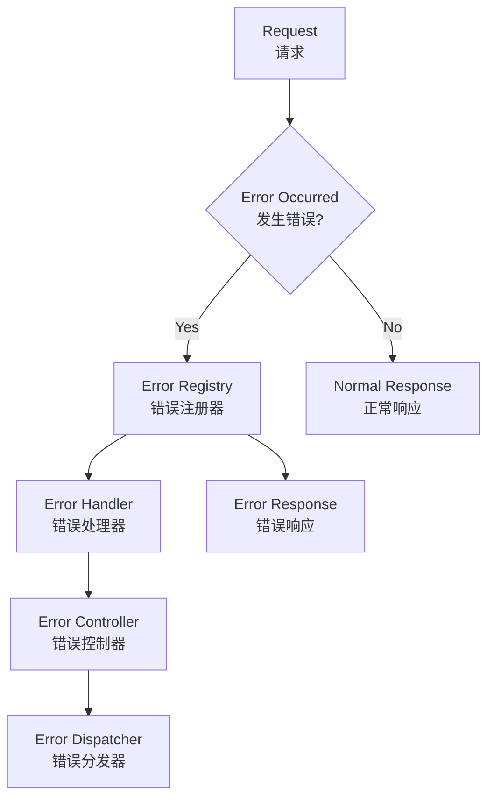

# ⚠️ YYHertz 错误处理系统概览

YYHertz框架提供了一套完整、强大且易用的错误处理系统，旨在帮助开发者构建稳定可靠的Web应用程序。

## 🏗️ 系统架构

### 核心组件

YYHertz错误处理系统由四个核心组件构成：



#### 🔧 ErrorRegistry (错误注册器)
- **职责**: 管理和注册各种错误处理器
- **特性**: 支持按状态码分组、处理器优先级、错误回退机制
- **使用场景**: 应用启动时注册全局错误处理器

#### 🎯 ErrorHandler (错误处理器)  
- **职责**: 定义具体的错误处理逻辑
- **特性**: 支持自定义实现、链式调用、条件判断
- **使用场景**: 处理特定类型的错误或实现业务逻辑

#### 🎮 ErrorController (错误控制器)
- **职责**: 提供默认的错误页面和响应格式
- **特性**: 美观的HTML页面、多格式支持(HTML/JSON/XML)、国际化
- **使用场景**: 为最终用户提供友好的错误体验

#### 📡 ErrorDispatcher (错误分发器)
- **职责**: 根据请求类型和错误状态分发到合适的处理器
- **特性**: 智能内容协商、处理器选择、性能优化
- **使用场景**: 自动选择最合适的错误处理方式

## 🌟 主要特性

### ✨ 统一的API接口
```go
// 简化的错误处理接口
errors.Handle(ctx, 404, err)                    // 快速处理
errors.Register(500, customHandler)             // 注册处理器
errors.QuickSetup("development")                // 快速配置
```

### 🧠 智能错误分类
系统能够自动识别和分类不同类型的错误：

| 错误类别 | 状态码范围 | 典型场景 | 处理策略 |
|---------|-----------|---------|----------|
| 客户端错误 | 4xx | 参数错误、权限不足 | 引导用户修正 |
| 服务器错误 | 5xx | 系统异常、资源不足 | 记录日志、自动恢复 |
| 业务逻辑错误 | 自定义 | 业务规则违反 | 业务处理流程 |
| 网络错误 | 超时/连接 | 外部服务调用 | 重试机制 |

### 🔄 自动错误恢复
```go
// 配置可重试的错误类型
retryConfig := &RecoveryConfig{
    MaxRetries:    3,
    RetryInterval: time.Second * 2,
    RetryableErrors: []int{500, 502, 503, 504},
}

// 启用自动恢复
errors.EnableRecovery(true)
errors.SetRecoveryConfig(retryConfig)
```

### 📊 详细的统计和监控
- **实时错误统计**: 按状态码、时间段、用户分组
- **性能监控**: 错误处理时间、成功率统计
- **告警机制**: 基于阈值的自动告警
- **可视化面板**: 错误趋势图表和分析报告

### 🎨 美观的默认错误页面
- **响应式设计**: 完美适配PC、平板、手机
- **多语言支持**: 中文、英文等多语言切换
- **可定制化**: 支持自定义样式、布局、交互
- **渐进增强**: JavaScript可选，基础功能不依赖JS

### 🔌 完整的向后兼容
- **API向后兼容**: 新版本完全兼容旧版本接口
- **渐进升级**: 可以逐步迁移到新的错误处理方式
- **灵活配置**: 支持新旧混用的过渡期配置

## 📈 版本信息

### 当前版本
- **错误处理系统版本**: v2.0.0
- **API版本**: v2
- **最低框架要求**: YYHertz v1.4.0+

### 版本历史
- **v2.0.0** (2024-12): 统一错误处理系统，新增自动恢复机制
- **v1.2.0** (2024-10): 添加业务错误码支持
- **v1.1.0** (2024-08): 完善错误监控和统计功能
- **v1.0.0** (2024-06): 初始版本发布

## 🚀 快速开始

### 一分钟上手
```go
package main

import (
    "github.com/zsy619/yyhertz/framework/mvc"
    "github.com/zsy619/yyhertz/framework/mvc/errors"
)

func main() {
    app := mvc.HertzApp
    
    // 🚀 一行代码启用错误处理
    errors.QuickSetup("development")
    
    // 🎯 注册自定义错误处理器（可选）
    errors.Register(404, customNotFoundHandler)
    
    app.Run()
}
```

### 五分钟进阶
想要了解更多高级配置？请查看 [快速开始指南](quick-start.md)。

## 📚 文档导航

| 文档 | 描述 | 适用场景 |
|------|------|----------|
| [快速开始](quick-start.md) | 5分钟上手指南 | 新手入门 |
| [默认处理器](default-handlers.md) | 内置错误处理器详解 | 了解默认功能 |
| [自定义处理器](custom-handlers.md) | 自定义错误处理逻辑 | 业务定制需求 |
| [错误页面定制](error-pages.md) | 个性化错误页面 | 视觉定制需求 |
| [错误监控](monitoring.md) | 错误统计和监控 | 生产环境运维 |
| [业务错误码](business-errors.md) | 业务逻辑错误处理 | API开发 |
| [自动恢复机制](recovery.md) | 智能错误恢复 | 高可用需求 |
| [最佳实践](best-practices.md) | 实战经验总结 | 性能优化 |
| [故障排除](troubleshooting.md) | 常见问题解决 | 问题排查 |

## 🌍 社区支持

- **GitHub**: [YYHertz Framework](https://github.com/zsy619/yyhertz)
- **文档**: [在线文档](/)
- **问题反馈**: [Issues](https://github.com/zsy619/yyhertz/issues)

---

> 💡 **提示**: 如果你是第一次使用YYHertz错误处理系统，建议从 [快速开始](quick-start.md) 开始阅读。